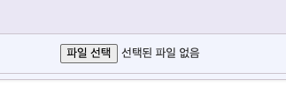
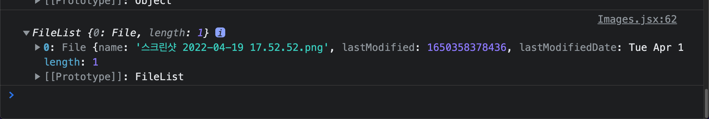
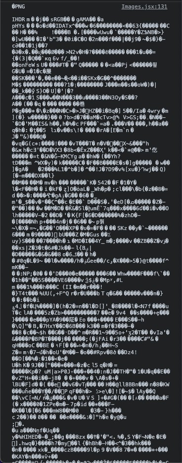
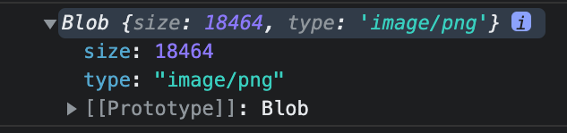
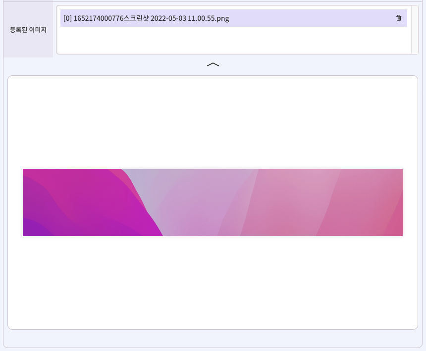

1. Axios
2. React w/JavaScript
3. multer (백엔드)

---

## HTML File Input을 통한 이미지 업로드

### 파일 타입의 input 엘리먼트 생성

```jsx
<form>
  <input type="file" accept="image/png, image/jpeg, image/jpg" />
</form>
```



유저가 파일을 업로드하는 창구로서 HTML input 태그의 `file` 타입을 이용하겠습니다. 우리는 이미지만 받을 것이기 때문에 accept 옵션을 통해 첨부 가능한 파일을 특정 이미지 파일 확장자로만 제한했습니다.

> [file input이란?](https://developer.mozilla.org/ko/docs/Web/HTML/Element/Input/file), mdn web docs

### onChange로 이용자의 파일 첨부 이벤트 리스닝

```javascript
const onFileChanges = (event) => console.log(event.target.files);
```

```jsx
<input
  type="file"
  accept="image/png, image/jpeg, image/jpg"
  onChange={(event) => onFileChanges(event)}
/>
```



input만 작성해서는 파일을 첨부해도 이미지 이름만 표시될 뿐 서버에 업로드할 수 없기 때문에, input에 onChange 이벤트를 걸어주어야 합니다. input 태그를 통해 받은 이미지는 내부적으로 알아서 FileList 객체로 변환됩니다.

콘솔 스크린샷에서 보다시피 FileList 객체는, key에 첨부한 파일의 index가 부여되고 value로 첨부한 File 객체가 할당되는 형식입니다. 우리는 이 value를 서버로 보내주기만 하면 됩니다.

> [File 객체란?](https://developer.mozilla.org/ko/docs/Web/API/File), mdn web docs

### 첨부한 File을 서버에 업로드

```javascript
const uploadFiles = axios.create({
  baseURL, // 이미 선언되었다고 가정함
  headers: { "Content-type": "multipart/form-data" },
  timeout: 5000,
});

const onFileChanges = ({ target: { files } }) => {
  uploadFiles
    .post("/upload", { image_file: files[0] })
    .then(({ data: { images } }) => setImagesList(images));
};
```

```jsx
<Lists>
  {imagesList.map((image, index) => (
    <List key={index}>{image.image_name}</List>
  ))}
</Lists>
```

파일 객체를 보낼 때에는 반드시 헤더의 `Content-type`을 `multipart/form-data`로 설정해주어야 백엔드에서 파일 객체를 올바르게 읽을 수 있다고 합니다. 그 외 나머지 부분은 다른 post 메소드를 사용할 때와 동일합니다.

제 경우에는 파일을 업로드하면 서버에서 그 응답값으로 지금까지 업로드 된 이미지들의 파일 이름 목록을 받도록 해서, 업로드 할 때마다 해당 응답값을 통해 이미지 목록을 다시 최신화시키고 싶었습니다. 따라서 응답으로 받은 리스트를 통해 다시 이미지 목록 배열 state를 최신화하는 과정까지 추가해주었습니다.

## 기업로드한 이미지 파일에 대한 열람 요청

### multer를 통해 응답 받은 바이너리 파일 확인

```javascript
const downloadFiles = axios.create({
  baseURL,
  headers: { "Content-type": "application/json; charset=UTF-8" },
  timeout: 5000,
});
```

```javascript
const onImageListClick = (imageId) => {
  downloadFiles.post("/registration/download", { imageId }).then(({ data }) => {
    console.log(data);
  });
};
```



기존에 업로드 했던 파일을 다시 열람하기 위해, 백엔드와 약속한 각 이미지의 고유 ID를 담아 새롭게 요청을 만들어서 보냈습니다.

당시 백엔드는 multer를 사용 중이었고, multer의 내장 함수 중 하나인 `sendFile()`을 통해 프론트에서 요청받은 이미지 ID와 일치하는 이미지를 찾아서 응답해주는 형식으로 진행되었는데, 그랬더니 콘솔에서 위와 같은 외계어를 만날 수 있었습니다. 이 상태로는 받은 이미지를 브라우저가 해석할 방법이 없기 때문에 우리는 이 바이너리 파일을 사용자가 볼 수 있는 형태로 변환해주어야 합니다.

### responseType 설정

```javascript
export const downloadFiles = axios.create({
  baseURL,
  headers: { "Content-type": "application/json; charset=UTF-8" },
  responseType: "blob",
  timeout: 5000,
});
```



앞서 업로드 과정에서 헤더의 `Content-Type`을 `multipart/form-data`로 지정해주었던것 기억나시나요? 마찬가지로 다시 받을 때도 올바른 응답 형식을 지정해줄 필요가 있습니다. `responseType`을 `blob`으로 설정해주면, 바이너리 파일이 외계어 대신 Blob 객체로 예쁘게 담겨져서 오는 것을 확인 할 수 있습니다.

### Blob 객체를 File 객체로 변환

```javascript
const onImageListClick = (imageId) => {
  downloadFiles.post("/download", { imageId }).then(({ data }) => {
    const newFile = new File([data], url);
  });
};
```

변환한 Blob 객체를 생성자 문법을 통해 우리가 처음에 보냈던 File 객체로 변환시켜줍니다. 이로서 최초 첨부파일에 담겼던 형태까지 되돌리는데에는 성공 했습니다.

### FileReader를 통해 File 객체를 브라우저가 이해할 수 있는 이미지 링크로 변환

```javascript
const onImageListClick = async (imageId) => {
  await downloadFiles.post("/download", { imageId }).then(({ data }) => {
    const newFile = new File([data], imageId);
    const reader = new FileReader(); // 1
    reader.onload = (event) => {
      const previewImage = String(event.target?.result);
      setImageURL(previewImage); // 2
    };
    reader.readAsDataURL(newFile); // 3
  });
  /* 후략 */
};
```

```jsx
return (
  <>
    <Lists>
      {imagesList.map((image, index) => (
        <List key={index} onClick={() => onImageListClick(image.imageId)}>
          [{index}] {image.image_name}
        </List>
      ))}
    </Lists>
    <Preview>
      
    </Preview>
  </>
);
```

1. 변환한 File 객체를 읽기 위해 FileReader 객체 생성

   > **`FileReader`** 객체는 웹 애플리케이션이 비동기적으로 데이터를 읽기 위하여 읽을 파일을 가리키는[`File`](https://developer.mozilla.org/ko/docs/Web/API/File) 혹은 [`Blob`](https://developer.mozilla.org/ko/docs/Web/API/Blob) 객체를 이용해 파일의 내용을 (혹은 raw data 버퍼로) 읽고 사용자의 컴퓨터에 저장하는 것을 가능하게 해줍니다.
   >
   > [FileReader](https://developer.mozilla.org/ko/docs/Web/API/FileReader), mdn web docs

2. FileReader가 모두 로드가 된 이후에 이벤트 타겟을 스트링으로 변환시킨 후, img 태그의 src 주소가 될 state에 값을 복사

   **`onload`**는 `FileReader` 객체의 읽기 동작이 성공적으로 완료되었을 때마다 실행할 일을 정할 수 있는 비동기 메소드입니다.

3. reader.readAsDataURL를 통해 아까 변환한 파일 객체를 넘기면 브라우저가 이미지를 볼 수 있는 링크가 생성

   > [readAsDataURL](https://developer.mozilla.org/ko/docs/Web/API/FileReader/readAsDataURL), mdn web docs

### 요청한 이미지가 잘 표시되는지 확인



끝~

---

#### 참고한 글

- [React + TypeScript에서 Axios로 Blob 이미지를 받기](https://velog.io/@hyunheal/Axios로-Blob-이미지를-받기)
- [서버에서 다운받은 바이너리 데이터를 img 태그에 넣고 이미지로 표시하는 방법?](https://webcorgi.tistory.com/40)
