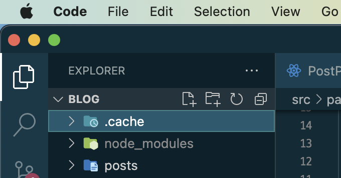

> 닷캐쉬 기술 블로그를 만들면서, 블로그의 첫 글을 함께 작성했다. 블로그를 만들게 된 계기, 배경, 과정 그리고 사용한 기술들에 대해서 간단히 기록해보았다.

## 제작 배경

회사를 퇴사한 이후에 시간 걱정 없이 자유롭게 공부할 수 있는 환경이 주어진 것은 너무 신나는 일이었지만, 금방 난관에 부딪혔다. 일단 생각과는 달리 내 시간이 무한하지는 않았다.

다른 사람들의 퇴사 후기나 부검 글들을 찾아보면서 퇴사 이후에 짧게는 6개월, 길게는 1년 이상 동안 홀로 공부를 하며 재정비를 했다는 후기들도 많이 보았지만, 나는 여전히 동료들과 머리를 맞대고 고민하는 회사생활이나 실무에 대한 욕심이 있었다. 같은 뜻을 가진 사람들과 소통하면서 실제로 누군가에게 필요한 코드를 작성하는 것만큼 실력이 빨리 느는 방법이 달리 없다고 생각했기 때문이다.

하고 싶은 공부는 정말 많지만 정해진 시간 안에 어떤 공부를 얼마나 빨리 내 것으로 만들 수 있는지를 생각하다 보니 고민이 깊어졌다. 그러다가 문득, 가장 우선순위로 놓게 된 것 중 하나가 블로그 만들기가 되었다. 제 아무리 내 손으로 직접 작성한 코드라 할지라도 바로바로 기록하지 않으면 금방 잊게 되고, 기록하면서 되새김질 하다보면 조금이라도 더 깊게 내가 공부했던 것들을 이해할 수 있다는 것은 약 1년 남짓의 개발자 인생에서 배운 중요한 깨달음 중 하나였다. 머릿 속에 둥둥 떠다니는 지식들은 마치 나의 것인 것 같지만서도 막상 글로 써보려고 하면 실상은 아무것도 몰랐다는 걸 알게 된다. 그래서 글쓰기를 위한 환경 만들기를 시작했다.

그리고 꼭 개발 이야기 아니더라도 다양한 주제의 글을 쓰고 싶다는 생각도 들었다! 글쓰기에 정말 자신이 없었기 때문에 더욱 글쓰기를 연습할 공간이 필요하다고 느꼈다. 별로 영양가 없는 일상 이야기나 제품 리뷰 같은 것들도 열심히 남기면서 꾸준히 키워가다 보면 뿌듯하지 않을까?

## 블로그 이름: dotCache

캐쉬는 은닉처라는 뜻을 가지고 있는데, 컴퓨터 과학에서는 빠르게 접근하여 데이터를 꺼내올 수 있는 저장공간을 의미한다. 내 블로그도 저장해두고 빠르게 불러올 수 있는 지식 창고 같은 느낌이 되었으면 해서 지어봤다. 막상 짓고 나니까 좀 부정적인 뜻도 겹칠 수 있는 것 같다. 금방금방 삭제되고 비운다는 뜻의 캐쉬가 아니다.. 사실 cash를 많이 벌고 싶다는 뜻이다...

## 기능 명세 작성

기능에 관한 것은 블로그를 직접 만들고 싶었던 이유 중 하나였는데, UI/UX를 직접 디자인해서 필요없는 기능들을 좀 배제하고 원하는 기능들만 적용해서 다루기 쉽게 만들고 싶었다. 그래봤자 블로그라서 대단한 기능이 있는 것은 아니었지만, 구글 검색으로 접해본 몇몇 훌륭한 기술 블로그들에서 영감을 받아서 제작 전에 미리 내 블로그에 적용시키고 싶은 기능들을 나열해보았다.

- 실시간 목차
- 이미지 레이지 로딩
- 각 포스트별 대표 이모티콘 지정
- 발행일 명시
- 태그 및 검색 기능
- 시리즈 기능

[zenn.dev](https://zenn.dev)와 [velog.io](https://velog.io)의 디자인에서 많이 영향을 받았다. 이 외에도 원한다면 얼마든지 나중에 기능을 추가할 수 있다는 것이 자체 개발 블로그의 장점(이자 단점)이 아닐까 싶다!

## 시안 제작

테마나 프리셋을 사용하지 않고 직접 디자인하면 블로그에 대한 애착이 더 생기지 않을까 생각했다. 디자인에 소질이 있는 편은 아니지만, 프론트엔드 개발자를 하기 전에는 사실 웹 디자인을 하고 싶었었다. '하고 싶었었다'라는 건 정식으로 배웠던게 아니라 대책없이 혼자 독학하며 무작정 어도비 XD로 이것저것 끄적였던 경험이 있었던 건데, 그래도 덕분에 도움이 되었던 것 같다!

시안은 피그마로 모두 제작했고, 대략적인 그림을 그려보는게 목적이었기 때문에 레이아웃이나 컴포넌트 같은 복잡한 기능은사용하지 않았다. 만드는 도중에도 디자인이 실시간으로 많이 바뀌었기 때문에 시안과 지금 디자인이 조금 달랐다는 걸 알 수 있다.

특이한 점이 있다면 마크다운 헤딩 태그 앞에 샵 표시를 붙이는 디자인을 꼭 하고 싶었다. 기억은 안나지만 어떤 블로그에서 보고 너무 예쁘다고 생각했었기 때문에..!

## 기술 선택

### Gatsby.js

이전에도 시험 삼아 개츠비로 블로그를 만들었던 적이 있었는데, 공식 문서나 플러그인 환경이 잘 갖춰진 편이었고 무엇보다 마크다운 관련 플러그인이 강력했기 때문에 블로그를 제작하기엔 최적의 정적 사이트 생성기라고 판단해 개츠비를 선택하였다. 무엇보다 GraphQL과 라우팅에 대한 솔루션이 너무 만족스러웠다. md 파일만 잘 관리해주면 경로가 알아서 생성되며 블로그가 유지되는 마법 같은 개발자 경험에 완전히 매료되었다.

### Tailwind CSS

꼭 Tailwind CSS를 사용할 필요는 없었지만, 요즘 완전히 빠져있는 CSS 프레임워크여서 잔뜩 써보고 싶다는 욕심이 들어 적용시켰다. 유틸리티 클래스 덕분에 특정 스타일의 구현을 위해 힘들게 여러 줄의 CSS를 작성하지 않아도 된다는 장점들도 있지만, 여전히 렌더부의 가독성과 스타일 유지보수 측면에서는 단점도 명확한 프레임워크라는 것을 많이 느꼈다. 그러나 이 블로그처럼 프로젝트의 복잡도가 높지 않은 경우이거나, 아토믹 디자인을 적용하는 등 체계적으로 컴포넌트를 분할하며 작업할 수 있는 경우라면 여전히 추천하고 싶다!

블로그 작업하면서 알게된건데 Tailwind CSS에 [@tailwindcss/typography](https://tailwindcss.com/docs/typography-plugin)라는 플러그인이 존재한다. 덕분에 MDX를 통해 생성한 마크다운 문서들을 크게 머리 아플 일 없이 예쁘게 포맷팅해주어서 고생을 덜었다.

### Giscus

처음에는 [utterances](https://utteranc.es/)를 적용하려 했는데, [giscus](https://giscus.app/ko)가 여러모로 이점이 많아보여서 채택하게 되었다. 적용 방법이 너무나도 간단해서 한 번 놀랐고, 로딩 속도와 가벼움에 두 번 놀랐다.

## 후기

이 글을 작성하는 시점에서 블로그는 아직 미완성 상태이다. 아직 검색 기능도 추가되어 있지 않고, 포스트 별로 시리즈로 묶는 기능도 추가될 예정이다. 태그나 카테고리의 기준이 나중에 얼마든지 바뀔 수도 있겠지만 일단 블로그를 런칭하고 싶어서 생각하던 몇 가지 기능이 빠진 채로 출시했다.

아직 해결해야 할 점들이 많이 남아있지만 개츠비로 개발하는 것 자체가 너무 재미있었다. 앞으로 기능 추가하거나 디자인을 변경하면서 더 발전시켜 나가면서 많은 사람들에게 도움이 될만한 블로그가 되었으면 좋겠다! 올해에는 더 많이 좋은 글을 쓸 수 있길,,
