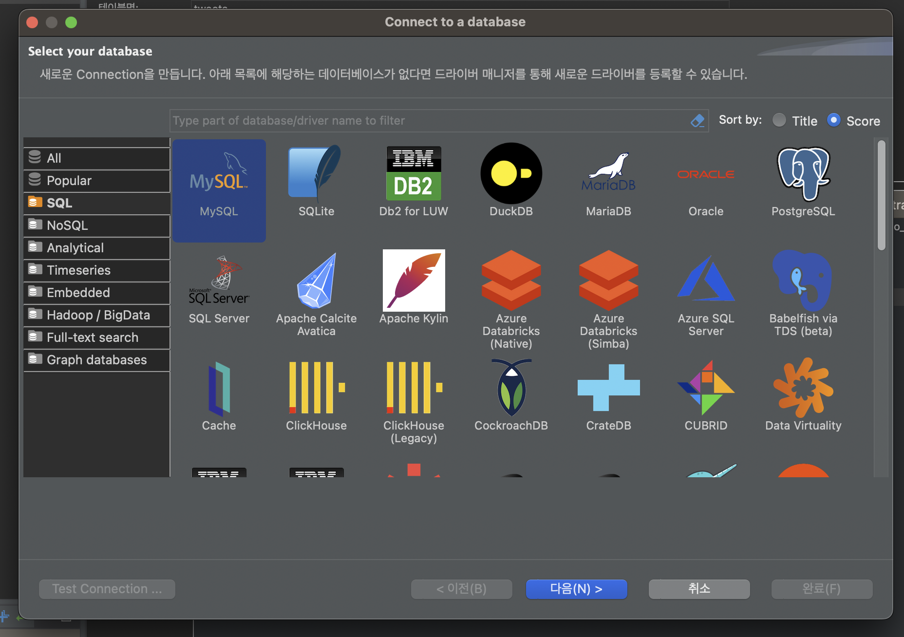
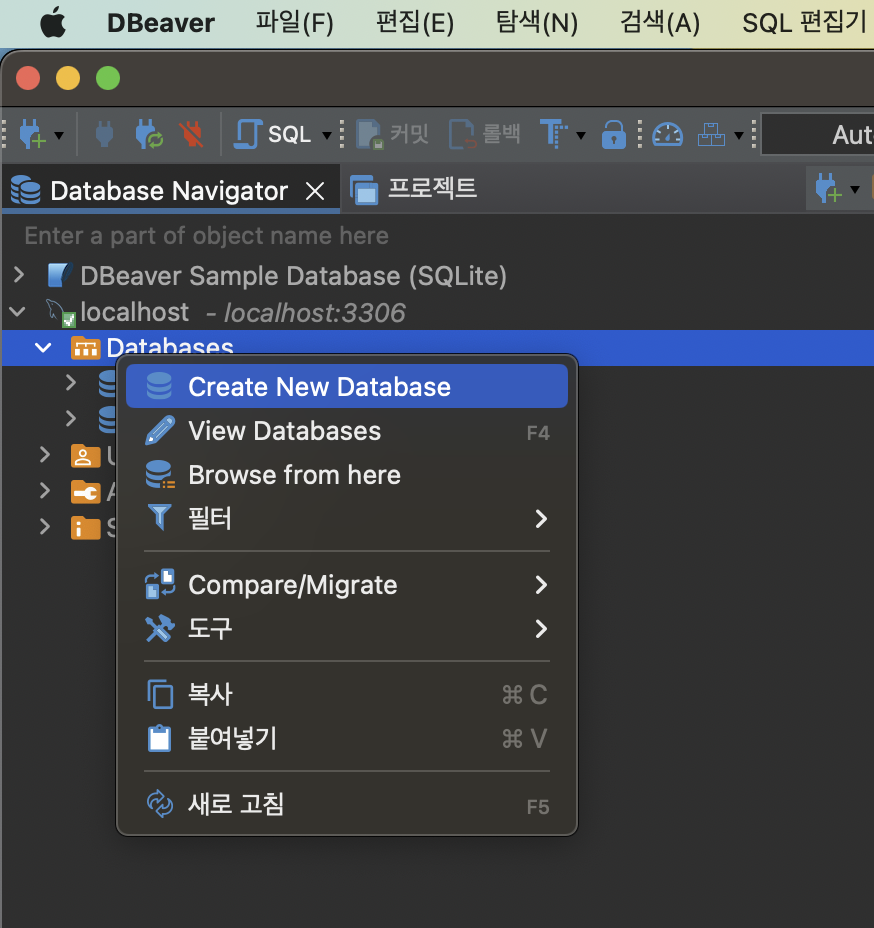

> 백엔드 초심자이자 맥 사용자 기준으로 작성되었습니다.

## MySQL 설치하기

```sh
brew install mysql
```

맥 (혹은 리눅스) 기준으로, homebrew를 통해 mysql을 설치해준다.

```sh
mysql.server start
```

그리고 위의 시작 명령어를 입력해주면 mysql 서버가 실행된다. 반대로 멈추고 싶으면 stop.

```sh
mysql_secure_installation
```

이후 위의 명령어를 입력하면 cli를 통해 mysql 연결에 대한 설정이 가능하다. 비밀번호 보안레벨과 비밀번호를 지정하는 등의 과정을 거치면 mysql 사용 준비가 완료된다.

## dbeaver 설치하기

```sh
brew install --cask dbeaver-community
```

애플 실리콘 맥을 사용 중인데, MySQL에서 제공하는 Workbench의 일부 기능을 이용할 때 무조건 튕기는 증상이 있어서 빠르게 포기하고 dbeaver community 에디션을 사용하기로 했다. 마찬가지로 homebrew를 통해 설치해준다.



Connect to a database에서 MySQL을 선택한 뒤, 이후 앞서 설정해주었던 로컬 MySQL 서버에 대한 비밀번호 등을 입력하면 성공적으로 연결된다.



Create New Database를 통해 프로젝트에서 사용할 새로운 데이터베이스를 만들어준다. 동일한 방식으로 DB내에 테이블과 컬럼 등을 GUI를 통해 손쉽게 설정해줄 수 있다.

## Express 프로젝트와 연결

### 패키지 설치

```sh
yarn add mysql2
```

[node-mysql2 | Github](https://github.com/sidorares/node-mysql2)

### mysql 설정 코드 작성

```javascript
import mysql from "mysql2";
import { config } from "../config.js";

const { database, user, password, port, host } = config.db;

const pool = mysql.createPool({
  host,
  port,
  user,
  database,
  password,
});

export const db = pool.promise();
```

데이터베이스 설정 파일을 만들어 위처럼 작성해주었다. 이후 앱 내에서 비동기로 요청을 할 것이므로 `creatPool`을 통해 데이터베이스 풀을 만든 후에 `.promise()` 붙여준 뒤에 export 해준다.

`createPool`로 db 연결을 설정할 때 host는 `localhost`라고 입력해주면 되는데, 만약에 안되는 경우에는 `127.0.0.1`로 작성해준다. 둘은 의미로서는 동일하기는 하나, 전자는 IPC 통신을 하고 후자는 TCP/IP 통신을 사용한다는 점에서 차이가 있다고 한다. 보안설정의 차이에 따라 후자를 입력해야 접속이 되는 경우가 있다.

[MySQL Server 연결 시 localhost와 127.0.0.1 차이 | Mimah님의 블로그](https://mimah.tistory.com/entry/MySQL-Server-%EC%97%B0%EA%B2%B0-%EC%8B%9C-localhost%EC%99%80-127001-%EC%B0%A8%EC%9D%B4)

### 서버 열기 전 db 연결 작업

```javascript
db.getConnection()
  .then(() => {
    console.log("MySQL DB Connected!");
    const server = app.listen(config.host.port);
    initSocket(server);
  })
  .catch(console.error);
```

이후 app.js에서 서버를 열기 전에 `db.getConnection()`을 통해 데이터베이스에 연결해주고, 이후 기존에 하던 것처럼 서버를 열어주면 익스프레스 서버와 데이터베이스 간의 연결이 완료된다.

### 쿼리문 작성

```javascript
export const findByUsername = async (username) => {
  return db
    .execute("SELECT * FROM users WHERE username=?", [username])
    .then((result) => {
      return result[0][0];
    });
};
```

`db.execute`를 통해 쿼리문을 작성하면 되는데, 첫 번째 인자로 쿼리문을 적어주고 두 번째 인자로는 ? 안의 값을 순서대로 배열 안에 담아서 넘겨주면 된다. 결과로 받아오는 형식을 잘 확인한 후에 리턴을 해주면 된다.
