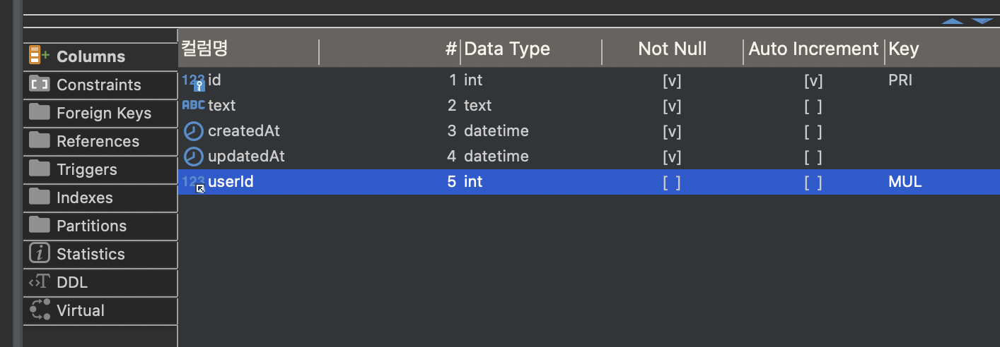

> Sequelize를 이용하면 쿼리문을 직접 작성하지 않고 Javascript 코드만을 이용하여 데이터베이스 내 테이블과 컬럼 등을 추가하는 것이 가능하다. 일부 상황에서는 제약도 있지만 복잡한 쿼리문이 필요없는 앱에서는 충분히 매력적인 대안이 될 수 있다. 이번 포스트에서는 Express 앱에서 Sequelize를 통해 MySQL 데이터베이스를 관리하는 방법에 대해 메모해보겠다.

[sequelize.org](https://sequelize.org)

## Sequelize 설치 및 연결

### 패키지 설치

```sh
yarn add sequelize
```

[Getting Started | Sequelize Docs](https://sequelize.org/docs/v6/getting-started/)

### 연결 설정

```javascript
import { config } from "../config.js";
import { Sequelize } from "sequelize";

const { database, user, password, host, port } = config.db;

export const sequelize = new Sequelize(database, user, password, {
  host,
  port,
  dialect: "mysql",
});
```

Sequelize 클래스를 위처럼 임포트하여 설정해주면 된다. 공식문서에도 잘 나와있지만 새 sequelize 인스턴스를 만들때 database, username, password 순으로 넘겨준 후에 옵션 오브젝트로 dialect 정보까지 넘겨주면 된다.

```javascript
import { sequelize } from "./db/database.js";

sequelize.sync().then(() => {
  const server = app.listen(config.host.port);
});
```

그리고 sync 함수를 이용하여 Sequelize와 최종적으로 연결해준 뒤에 기존 방식대로 서버를 열어주면 연결이 완료된다.

## 테이블 생성

```javascript
import { DataTypes } from "sequelize";
import { sequelize } from "../db/database.js";

const Tweet = sequelize.define("tweets", {
  id: {
    type: DataTypes.INTEGER,
    autoIncrement: true,
    primaryKey: true,
    allowNull: false,
  },
  text: {
    type: DataTypes.TEXT,
    allowNull: false,
  },
});
```

`sequelize.define`을 이용하면 새로운 테이블과 컬럼의 특성을 정의할 수 있다. 이렇게 생성하면 쿼리문 작성을 전혀 하지 않고 자바스크립트 코드만을 이용하여 테이블을 만들 수 있게 된다. (Sequelize에서는 Model 이라고 부른다.) 별도의 옵션을 넘기지 않으면 `updatedAt`과 `createdAt` 등의 타임스탬프도 알아서 찍어준다.

```javascript
import { User } from "./users.js";

Tweet.belongsTo(User);
```

foreignKey를 통해 다른 테이블과 연결하고 싶은 경우에는 위처럼 코드 한줄이면 된다. 아래 스크린샷을 보면 알아서 해당 테이블의 primaryKey를 통해 foreignKey를 생성해준 것을 알 수 있다.



컬럼명도 알아서 센스있게 `테이블명+primaryKey` 이름으로 붙여준다. 혹은 옵션을 통해 foreignKey 명칭을 커스텀 하는 것도 가능하다.

[Providing the foreign key name directly | Sequelize Docs](https://sequelize.org/docs/v6/core-concepts/assocs/#providing-the-foreign-key-name-directly)

## 쿼리 함수 작성

```javascript
export const create = async (user) => {
  return User.create(user).then(({ dataValues }) => dataValues.id);
};

export const findByUsername = async (username) => {
  return User.findOne({ where: { username } });
};

export const findById = async (id) => {
  return User.findByPk(id);
};
```

`create()`를 이용하면 알아서 매개변수 값을 INSERT 해주며, `findOne`은 조건에 맞는 결과를 하나만 찾아서 반환하고 옵션을 통해 where 절에 해당하는 조건을 제공할 수 있다. `findByPk`는 주어진 값이 테이블의 `primaryKey`와 일치하는 컬럼을 찾아서 반환한다.

이외에도 `save()`나 `destory()` 등의 메소드를 통해 update나 delete 명령을 수행하는 등, 다양한 편의 기능이 있으므로 공식문서를 참조하면 좋을 것 같다.

## 추가) 결과 오브젝트 평탄화하기

관계형의 응답 데이터로 foreignKey를 이용해 다른 테이블에 있는 데이터를 함께 보내주고 싶을 때가 있다. 이럴 때 include 옵션을 사용하면 관련된 다른 테이블의 데이터를 함께 보내줄 수 있는데, 기본적으로는 오브젝트 여러개가 중첩된 형태로 보내주게 된다. 이때 원하는 데이터 형태로 평탄화 해줄 수 있는 방법이 있다.

```javascript
import { sequelize } from "../db/database.js";

export const getAll = async () => {
  return Tweet.findAll({
    include: {
      model: User,
      attributes: [],
    },
  });
};
```

먼저 include 옵션을 이용하면 앞서 말했듯 다른 테이블의 데이터를 함께 불러올 수 있다. attributes 옵션 안에는 가져오고 싶은 모델 중에서 또 다시 오브젝트가 중첩되기를 원하는 값이 있다면 배열 안에 넘기면 된다. 그러나 다른 모델 내에서 중첩된 오브젝트까지는 딸려오지 않기를 원할 때는 attributes에 빈 배열을 넘기면 그보다 더 중첩된 오브젝트는 제외한 채로 불러올 수 있다. 그러나 이 단계까지 마쳐도 아직 user 모델 안의 정보들은 user라는 키 안에 오브젝트 형태로 담긴 채 전달이 된다.

[Specifying attributes from the through table | Sequelize Docs](https://sequelize.org/docs/v6/advanced-association-concepts/advanced-many-to-many/#specifying-attributes-from-the-through-table)

```javascript
import { sequelize } from "../db/database.js";

export const getAll = async () => {
  return Tweet.findAll({
    attributes: [
      "id",
      "text",
      "createdAt",
      "userId",
      [Sequelize.col("user.username"), "username"],
      [Sequelize.col("user.url"), "url"],
    ],
    include: {
      model: User,
      attributes: [],
    },
  });
};
```

attributes 옵션의 역할을 알았을테니 여기서도 동일한 룰이 적용된다. 이제 배열 안에 넘긴 값 이외에는 중첩된 user 오브젝트는 표시되지 않게 된다. 우선 attributes 옵션 안에 기존 테이블에서 가져오고 싶은 키를 하나씩 입력해주고, 덧붙여 앞서 include를 통해 가져오도록 설정했던 다른 모델의 데이터를 `col` 메소드를 통해 임의의 키로 지정하여 가져올 수 있다.

```javascript
[Sequelize.col("user.username"), "username"];
```

`col` 메소드에 대해 더 살펴보자면 위 구문은 user 모델 안에서 가져온 `user.username`을 `username`이라는 이름으로 사용하겠다는 의미가 된다.

> Creates a object representing a column in the DB. This is often useful in conjunction with `sequelize.fn`, since raw string arguments to fn will be escaped.

[.col | Sequelize Docs](https://sequelize.org/api/v6/class/src/sequelize.js~sequelize#static-method-col)
