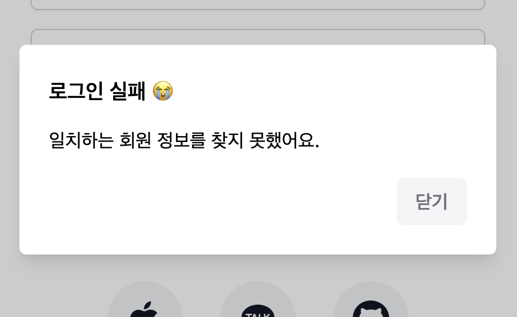

Radix는 최근 트위터나 유튜브에서 자주 봐서 써보고 싶다고 생각했던 라이브러리인데, 정체를 간단히 요약하자면 “오픈 소스 기반의 헤드리스 UI 라이브러리”이다. 자주 사용하는 UI 컴포넌트들의 기능적인 부분을 미리 완벽히 구현해두고 추가로 접근성 처리까지 되어있어 개발자의 수고를 크게 덜어준다. 게다가 헤드리스한 특성 덕분에 작업 중인 프로젝트에 맞는 디자인을 마음대로 입힐 수가 있고, 각 UI 컴포넌트들이 별도의 라이브러리로 구성되어있어 필요한 부분만 설치해서 가볍게 사용할 수 있다는 점도 장점 중 하나라고 볼 수 있을 것 같다. 개인적으로는 이번에 진행 중인 Next.js 기반의 사이드 프로젝트에서 한 번 활용해보면 어떨까 싶어 도입하게 되었다.

[https://www.radix-ui.com/](https://www.radix-ui.com/)

공식문서를 살펴보면서 예시를 보면 알겠지만 미리 제시해주는 디자인과 CSS 혹은 Tailwind 코드들도 있어서 이것만 조금 참고해도 괜찮은 디자인을 뽑아낼 수 있다. 그리고 [Radix를 기반으로 만들어진 UI 라이브러리](https://ui.shadcn.com/)도 있으니 디자인까지 되어있는 라이브러리가 필요하다면 이쪽을 참고해봐도 좋을 것 같다.

## 라이브러리 설치

```shell
yarn add @radix-ui/react-alert-dialog
```

앞서 말했듯 원하는 컴포넌트만 쪼개서 설치하는게 가능하다! 이 글에서는 Alert Dialog를 커스텀 훅을 통해 선언적으로 표시할 수 있도록 만드는 것에 대해 다룰 것이므로 react-alert-dialog만 설치해준다!

[https://www.radix-ui.com/docs/primitives/components/alert-dialog](https://www.radix-ui.com/docs/primitives/components/alert-dialog)

## 커스텀 훅을 어떻게 사용할까?

```typescript
const [DialogComponent, { openDialog, closeDialog }] = useAlertDialog({
  title: "로그인 실패 😭",
  description: "일치하는 회원 정보를 찾지 못했어요.",
  error,
});
```

리액트 앱을 만들면서 정말 즐거운(?) 순간 중 하나인 커스텀 훅 만들기. 매번 고민하긴 하지만 개인적으로 커스텀 훅을 가장 빠르게 잘 만드는 방법은 미리 어떤 식으로 이 훅을 사용하면 좋겠다 싶은지, 아직 작동하지는 않더라도 커스텀 훅을 사용하는 부분의 코드를 먼저 짜보는 것이 가장 효율적인 것 같다. 이번에는 커스텀 훅을 통해 표시하고 싶은 정보를 건네주면 다이얼로그 컴포넌트와 컴포넌트 표시 여부를 컨트롤 할 수 있는 함수들을 받아왔으면 좋겠다는 생각에 위와 같이 훅 사용을 정의해보았다.

## alert-dialog.tsx 작성

```tsx
import * as AlertDialog from "@radix-ui/react-alert-dialog";
import { NextPage } from "next";

interface AlertDialogComponentProps {
  isOpen: boolean;
  setIsOpen: React.Dispatch<React.SetStateAction<boolean>>;
  title: string;
  description: string;
}

const AlertDialogComponent: NextPage<AlertDialogComponentProps> = ({
  isOpen,
  setIsOpen,
  title,
  description,
}) => {
  return (
    <AlertDialog.Root open={isOpen} onOpenChange={setIsOpen}>
      <AlertDialog.Portal>
        <AlertDialog.Overlay className="data-[state=open]:animate-overlayShow bg-black bg-opacity-20 fixed inset-0" />
        <AlertDialog.Content className="data-[state=open]:animate-contentShow fixed top-[50%] left-[50%] max-h-[85vh] w-[90vw] max-w-[500px] translate-x-[-50%] translate-y-[-50%] rounded-[6px] bg-white p-[25px] shadow-lg focus:outline-none">
          <AlertDialog.Title className="font-semibold text-lg">
            {title}
          </AlertDialog.Title>
          <AlertDialog.Description className="mt-4 mb-5 leading-normal">
            {description}
          </AlertDialog.Description>
          <div className="flex justify-end">
            <AlertDialog.Cancel asChild>
              <button className="text-gray-500 bg-gray-100 hover:bg-gray-200 h-10 items-center justify-center rounded-md px-4 font-medium outline-none">
                닫기
              </button>
            </AlertDialog.Cancel>
          </div>
        </AlertDialog.Content>
      </AlertDialog.Portal>
    </AlertDialog.Root>
  );
};

export default AlertDialogComponent;
```

components 폴더에 `alert-dialog.tsx`를 작성했는데, 공식 문서에 있는 예제를 거의 그대로 참고한 코드이다. 다른 점이 있다면 색상이나 간격 값을 Radix에서 만든 값 대신에 Tailwind CSS에서 기본으로 제공하는 색상과 간격 값으로 변경하였다. `tailwind.config.js`도 수정하여 커스텀 애니메이션 속성도 똑같이 추가해주었다.

## 커스텀 훅 작성 (useAlertDialog)

```tsx
import AlertDialogComponent from "@components/alert-dialog";
import { useEffect, useState } from "react";

interface UseAlertDialogProps {
  title: string;
  description: string;
  error?: boolean;
}
interface UseAlertDialogState {
  isOpen: boolean;
  openDialog: () => void;
  closeDialog: () => void;
}
type UseAlertDialogResult = [() => JSX.Element, UseAlertDialogState];

export default function useAlertDialog({
  title,
  description,
  error,
}: UseAlertDialogProps): UseAlertDialogResult {
  const [isOpen, setIsOpen] = useState(false);
  const openDialog = () => setIsOpen(true);
  const closeDialog = () => setIsOpen(false);

  useEffect(() => {
    if (error) {
      openDialog();
    }
  }, [error]);

  const Component = () => (
    <AlertDialogComponent
      title={title}
      description={description}
      isOpen={isOpen}
      setIsOpen={setIsOpen}
    />
  );

  return [Component, { isOpen, openDialog, closeDialog }];
}
```

처음에 정해뒀던 커스텀 훅 사용부에 맞는 값을 되돌려주기 위해 위처럼 작성해보았다. 다이얼로그를 컨트롤 하기 위해서 isOpen이라는 state와 state 값을 변경하는 함수들을 만들어주었고, hook을 선언할 때 error라는 boolean를 받아와서 error가 발생한 경우에 자동으로 다이얼로그를 표시시키는 기능도 추가하였다.

## 커스텀 훅 사용해보기

```tsx
import { useLazyQuery, gql } from "@apollo/client";
import { useForm } from "react-hook-form";
import { useEffect } from "react";
import { useRouter } from "next/router";
import Link from "next/link";
import ExternalLoginButton from "@components/external-login-button";
import SubmitButton from "@components/submit-button";
import TextInput from "@components/text-input";
import useAlertDialog from "@libs/useAlertDialog";

const GET_LOGIN = gql`
  query GetLogin($username: String!, $password: String!) {
    login(username: $username, password: $password) {
      status
    }
  }
`;

interface LoginResponse {
  login: {
    status: string;
  };
}

interface LoginForm {
  username: string;
  password: string;
}

const SignIn = () => {
  const router = useRouter();
  const { register, handleSubmit } = useForm<LoginForm>();

  const [getLogin, { loading, error, data }] = useLazyQuery<
    LoginResponse,
    LoginForm
  >(GET_LOGIN);
  const onValid = async (formData: LoginForm) => {
    if (loading) return;
    await getLogin({ variables: formData });
  };

  const [LoginFailure] = useAlertDialog({
    title: "로그인 실패 😭",
    description: "일치하는 회원 정보를 찾지 못했어요.",
    error: !!error,
  });

  return (
    <>
      <LoginFailure />
      <main className="max-w-2xl mx-auto">
        <section className="flex p-8 my-10">
          <h1 className="text-4xl font-bold leading-snug">로그인</h1>
        </section>
        <form
          onSubmit={handleSubmit(onValid)}
          className="flex flex-col gap-4 p-8"
        >
          <TextInput
            register={register("username")}
            placeholder="아이디"
            loading={loading}
          />
          <TextInput
            type="password"
            register={register("password")}
            placeholder="비밀번호"
            loading={loading}
          />
          <SubmitButton text="로그인" loading={loading} />
        </form>
        <div className="px-8 pb-8 flex justify-center">
          <p className="text-sm text-gray-500">
            아직 계정이 없나요?{" "}
            <Link href="/auth/signup" className="underline text-violet-600">
              회원가입 하기
            </Link>
          </p>
        </div>
        <div className="flex gap-8 pt-8 justify-center">
          <ExternalLoginButton icon="apple" />
          <ExternalLoginButton icon="kakao" />
          <ExternalLoginButton icon="github" />
        </div>
      </main>
    </>
  );
};

export default SignIn;
```



애니메이션까지 적용되어 성공적으로 표시되는 것을 확인할 수 있었다! 매번 다이얼로그를 사용할 때마다 딸린 state를 매번 새롭게 작성할 필요없이, 화면 어디서든지 useAlertDialog만 이용하면 원하는 내용의 다이얼로그를 표시시킬 수 있게 되었다. 여기서 조금만 더 고안해봐도 (커스텀 버튼을 추가한다던가 등) 더 강력한 기능의 다이얼로그를 만들 수도 있을 것 같다!

## 정리하면서

Radix를 맛보면서 함께 덤으로 커스텀 훅까지 만들어보았는데, 커스텀 훅 작성의 장점은 반복적인 코드 작성을 훨씬 선언적이고 알기 쉽게 적을 수 있다는 점인 것 같다. 또, 스스로 만들었기 때문에 나중에 기능 추가에 대응하기도 쉽고.. 여러모로 정말 리액트 개발의 큰 재미 중 하나라고 생각한다! 그리고 radix에는 오늘 살펴본 컴포넌트 이외에도 정말 다양한 컴포넌트들이 마련되어 있기 때문에 이렇게 커스텀 훅과 묶어서 사용하도록 설정해두면 자주 사용하는 기능들을 머리 아플 일 없이 휙휙 구현할 수 있을 것 같아서 남은 개발에도 필요할 때마다 열심히 사용해봐야겠다.
