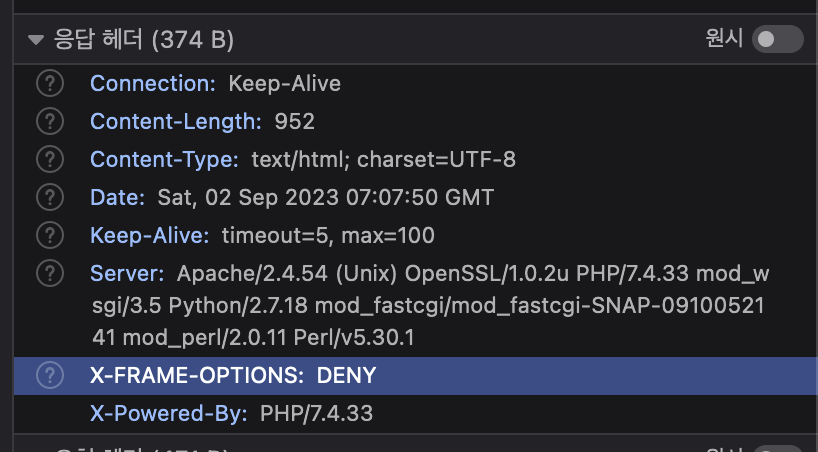

## PHP 설정 파일 (php.ini)

`phpinfo()`로 현재 php 프로젝트의 설정 내역을 볼 수 있는데, 이 설정을 실제로 바꾸고 싶으면 `php.ini` 파일을 수정해주면 된다. `phpinfo()`로 표시된 결과 중 Loaded Configuration File의 경로로 가면 `php.ini` 파일의 위치를 알아낼 수 있다. 또한 기본값으로 `display_errors`가 Off로 되어 있기 때문에 On으로 수정해준다.

## exit

```php
<?php
$test = 123;
$test_2 = 456;

echo $test;
var_dump($test);
exit;
echo $test_2;
^^^^^^^^^^^^^ unreachable code detected
```

`exit()`을 사용하면 이후의 코드는 실행하지 않는다. 디버깅 할 때 일단 멈춰두고 특정 변수나 인자의 값을 확인할 때 활용하면 유용하다.

## GET, POST

```html
<form method="POST" action="index.php">
  氏名
  <input type="text" name="name" />
  <br />
  <input type="checkbox" name="sports[]" value="野球" />野球
  <input type="checkbox" name="sports[]" value="サッカー" />サッカー
  <input type="checkbox" name="sports[]" value="バスケ" />バスケ
  <input type="submit" value="送信" />
</form>
```

이런 폼이 있다고 치자. form의 method로 HTTP 메소드를 명시하고, action은 현재 파일 이름을 명시한다. 각 input의 name은 php에서 값을 가져올 때 사용하게 되며, 체크박스처럼 뒤에 `[]` 가 붙은 경우에는 같은 명칭이 여러개 있을때를 의미한다.

```php
<?php
if (!empty($_GET['name'])) {
  echo '<pre>';
  var_dump($_GET);
  echo '</pre>';
}
?>
<!-- array(2) {
  ["name"]=>
  string(15) "ヒョンジン"
  ["sports"]=>
  array(1) {
    [0]=>
    string(12) "サッカー"
  }
} -->
```

php 코드를 작성해서 해당 페이지에서 보내는 요청을 전부 살펴볼 수도 있다. 이름 인풋에 뭘 적었는지, 체크박스는 뭘 골랐는지가 한 번에 나오며, 메소드가 GET인 경우에는 url에 물음표 쿼리가 붙어서 표시되어 해당 url 자체에 폼에 대한 값이 담기게 된다. 만약 원하지 않는다면 POST 메소드의 경우에는 url의 변경이 발생하지 않는다.

`$_` 로 시작하는 변수를 슈퍼 글로벌 변수라고 부르며, 객체의 형태를 가진다. php에는 이러한 슈퍼 글로벌 변수가 9종류 있다.

[https://www.php.net/manual/en/language.variables.superglobals](https://www.php.net/manual/en/language.variables.superglobals)

## php와 HTML의 병기

```php
<?php if ($pageFlag === 0) :?>
  ...
<?php endif; ?>
```

if문 등으로 php 코드 사이에 HTML 코드를 조건부 표시하는 코드를 작성하게 되는 경우가 많다. 이럴 때 기존의 if문처럼 중괄호를 사용하게 되면 어디까지가 끝인지 알아보기 힘든데, 콜론과 endif를 이용하여 if문을 작성하는 것도 가능하므로 HTML 코드와 병기할 때는 이 방법을 활용한다.

## php로 간단한 폼 만들기

```php
<?php if ($pageFlag === 0): ?>
  <form method="POST" action="index.php">
    氏名
    <input type="text" name="name" value="<?php if (!empty($_POST['name']))
      echo $_POST['name']; ?>" />
    <br />
    メールアドレス
    <input type="email" name="email" value="<?php if (!empty($_POST['email']))
      echo $_POST['email']; ?>" />
    <br />
    <input type="submit" name="btn_confirm" value="確認する" />
  </form>
<?php endif; ?>

<?php if ($pageFlag === 1): ?>
  <form method="POST" action="index.php">
    氏名
    <?php echo $_POST['name']; ?>
    <br />
    メールアドレス
    <?php echo $_POST['email']; ?>
    <br />
    <input type="submit" name="back" value="戻る" />
    <input type="submit" name="btn_submit" value="送信する" />
    <input type="hidden" name="name" value="<?php echo $_POST['name']; ?>" />
    <input type="hidden" name="email" value="<?php echo $_POST['email']; ?>" />
  </form>
<?php endif; ?>

<?php if ($pageFlag === 2): ?>
  <h1>送信を完了しました。</h1>
<?php endif; ?>
```

앞서 살펴본 이론을 바탕으로 폼을 작성해보았다. 보통 php 파일을 복수개 만들어서 진행하는 경우도 많지만 이번 폼은 간단하므로 pageFlag라는 php 변수에 따라 다른 페이지가 표시되도록 설정하였다.

확인하기 페이지에서 hidden input을 두는 이유는, 페이지가 바뀔 때 유저가 입력했던 인풋값을 기억하기 위함이며 이는 GET 요청처럼 유저의 입력값이 url에 들어가는 경우에는 굳이 해줄 필요는 없다.

```php
<? php
$pageFlag = 0;

echo ('<pre>');
var_dump($_POST);
echo ('</pre>');

if (!empty($_POST['btn_confirm'])) {
  $pageFlag = 1;
}
if (!empty($_POST['btn_submit'])) {
  $pageFlag = 2;
}
?>
```

php 코드에서는 각 페이지의 확인 버튼을 누를 때마다 다음 페이지로 넘어가기 위한 작업을 해주었다. empty로 검증하는 이유는 input을 누른 시점에 해당 input에 value가 지정되므로 이런 식으로 체크하는 것이 가능하다.

## XSS (Cross-Site Scripting) 대책

```php
<? php
  function h($str)
  {
    return htmlspecialchars($str, ENT_QUOTES, 'UTF-8');
  }
?>
```

폼의 인풋에 <script /> 태그를 삽입하면 그대로 실행되어 보안에 취약하게 된다. 그럴 때 위의 코드를 이용하여 감싸주면 인풋으로 들어오는 스크립트 코드를 실행되지 않도록 막아줄 수 있다.

[https://www.php.net/manual/en/function.htmlspecialchars.php](https://www.php.net/manual/en/function.htmlspecialchars.php)

## 클릭 재킹 대책

```php
<? php
  header('X-FRAME-OPTIONS:DENY');
  // ...
?>
```

클릭 재킹이란 클릭할 수 있는 버튼을 탈취하는 방식의 공격 방법이다. 공격자가 css 등으로 폼 위에 투명한 버튼을 놓아서 원하는 액션을 취하게 된다. 서버 측에서 막는 방법과 php 코드 상에서 막는 방법이 있는데, php 코드 상에서 막기 위해서는 위의 코드를 작성해주면 된다.



php의 header 함수는 HTTP header 안에 정보를 담아서 보내는 형식으로 동작한다.

## CSRF (Cross-Site Request Forgeries) 대책

CSRF 공격이란, 공격자가 특정 이용자에게 피싱 사이트에 접속 시킨 후 자동 로그인 등이 되어있는 다른 사이트에 접속했을 때 해당 이용자로 하여금 원하지 않는 위조 요청을 보내도록 강제하는 공격 방식이다. 이를 해결하기 위해서는 암구호를 정해서 위조된 요청을 받지 않도록 처리해두는 것이 중요한데, 이 때 사용할 수 있는 것이 세션 혹은 토큰이다.

```php
<? php
  session_start();
?>
```

코드 제일 시작부분에 `session_start()`를 넣어서 세션을 시작할 수 있다. 이제 `$_SESSION`을 사용할 수 있게 된다. 다시 말하자면 세션을 이용하는 이유는 서버와 이용자 사이에 키가 일치하는지 확인하여 위조된 요청을 사전에 차단하기 위함이다.

[https://teserre.tistory.com/8](https://teserre.tistory.com/8)

```php
<?php if ($pageFlag === 0): ?>
  <?php
  if (!isset($_SESSION['csrfToken'])) {
    $csrfToken = bin2hex(random_bytes(32));
    $_SESSION['csrfToken'] = $csrfToken;
  }
  $token = $_SESSION['csrfToken'];
  ?>
  <form method="POST" action="index.php">
    氏名
    <input type="text" name="name" value="<?php if (!empty($_POST['name']))
      echo h($_POST['name']); ?>" />
    <br />
    メールアドレス
    <input type="email" name="email" value="<?php if (!empty($_POST['email']))
      echo h($_POST['email']); ?>" />
    <br />
    <input type="submit" name="btn_confirm" value="確認する" />
    <input type="hidden" name="csrf" value="<?php echo $token; ?>" />
  </form>
<?php endif; ?>
```

폼의 가장 첫 화면에 위 코드를 작성한다. random_bytes 함수는 바이트 코드로 무작위 난수를 생성해주는데, `bin2hex()` 함수를 이용하여 이를 우리가 읽을 수 있는 형태로 변환해준다. 이 난수를 이용자와 주고 받는 키로 활용하게 된다.

`$_SESSION[‘cerfToken’]` 에 저장하면 되는데, 세션에 이미 저장을 해둔 상태인데도 계속해서 난수를 생성해도 의미가 없으므로 한 번 접속하여 세션이 생성되었으면 더 이상 실행되지 않도록 `isset()`으로 토큰에 대한 세션이 생성되었는지 먼저 확인하는 과정을 거치도록 한다.

그리고 다음 폼으로 넘어가더라도 토큰 값을 계속 기억하기 위해서 hidden input을 추가해 value로 변수를 넘겨준다.

```php
<?php if ($pageFlag === 1): ?>
  <?php if ($_POST['csrf'] === $_SESSION['csrfToken']): ?>
    <form method="POST" action="index.php">
      氏名
      <?php echo h($_POST['name']); ?>
      <br />
      メールアドレス
      <?php echo h($_POST['email']); ?>
      <br />
      <input type="submit" name="back" value="戻る" />
      <input type="submit" name="btn_submit" value="送信する" />
      <input type="hidden" name="name" value="<?php echo h($_POST['name']); ?>" />
      <input type="hidden" name="email" value="<?php echo h($_POST['email']); ?>" />
      <input type="hidden" name="csrf" value="<?php echo $_POST['csrf']; ?>" />
    </form>
  <?php endif; ?>
<?php endif; ?>
```

두 번째 폼에서는 첫 번째 폼에서 작성했던 내용을 확인하는 과정이다. 만약 세션에 저장된 토큰과 사용자에게서 POST 요청을 통해 넘겨받은 토큰이 일치하지 않는다면 두 번째 폼이 표시되지 않도록 if 문으로 차단시키는 코드를 추가했다.

```php
<?php if ($pageFlag === 2): ?>
  <h1>送信を完了しました。</h1>
  <input type="hidden" name="csrf" value="<?php echo $_POST['csrf']; ?>" />
  <?php unset($_SESSION['csrfToken']); ?>
<?php endif; ?>
```

마지막 완료 안내 폼에서는 세션에 더 이상 토큰을 가지고 있을 필요가 없기 때문에 `unset()` 함수를 통해 토큰을 세션에서 삭제시켜주면 된다.

## 유효성 검사 (バリデーション)

```php
<?php if ($pageFlag === 0): ?>
<?php
  if (!isset($_SESSION['csrfToken'])) {
      $csrfToken = bin2hex(random_bytes(32));
      $_SESSION['csrfToken'] = $csrfToken;
  }
  $token = $_SESSION['csrfToken'];
    ?>
<?php if (!empty($errors) && !empty($_POST['btn_confirm'])) : ?>

<form method="POST" action="index.php">
  氏名
  <input type="text" name="name" value="<?php if (!empty($_POST['name'])) {
      echo h($_POST['name']);
  } ?>" />
  <br />
  メールアドレス
  <input type="email" name="email" value="<?php if (!empty($_POST['email'])) {
      echo h($_POST['email']);
  } ?>" />
  <br />
  ホームベージ
  <input type="url" name="url" value="<?php if (!empty($_POST['url'])) {
      echo h($_POST['url']);
  } ?>" />
  <br />
  性別
  <input type="radio" name="gender" value="0" <?php if (isset($_POST['gender']) && $_POST['gender'] === '0') {
      echo 'checked';
  } ?>>男性
  <input type="radio" name="gender" value="1" <?php if (isset($_POST['gender']) && $_POST['gender'] === '1') {
      echo 'checked';
  } ?>>女性
  <br />
  年齢
  <select name="age">
    <option value="">選択してください</option>
    <option value="1" <?php if (!empty($_POST['age']) && $_POST['age'] === '1') {
        echo 'selected';
    } ?>>~19歳</option>
    <option value="2" <?php if (!empty($_POST['age']) && $_POST['age'] === '2') {
        echo 'selected';
    } ?>>20歳 ~ 29歳</option>
    <option value="3" <?php if (!empty($_POST['age']) && $_POST['age'] === '3') {
        echo 'selected';
    } ?>>30歳 ~ 39歳</option>
    <option value="4" <?php if (!empty($_POST['age']) && $_POST['age'] === '4') {
        echo 'selected';
    } ?>>40歳 ~ 49歳</option>
    <option value="5" <?php if (!empty($_POST['age']) && $_POST['age'] === '5') {
        echo 'selected';
    } ?>>50歳 ~ 59歳</option>
    <option value="6" <?php if (!empty($_POST['age']) && $_POST['age'] === '6') {
        echo 'selected';
    } ?>>60歳 ~</option>
  </select>
  <br />
  お問い合わせ内容
  <textarea name="contact"><?php if (!empty($_POST['contact'])) {
      echo h($_POST['contact']);
  } ?></textarea>
  <br />
  注意事項のチェック
  <input type="checkbox" name="caution" value="1" />注意事項にチェックする
  <input type="submit" name="btn_confirm" value="確認する" />
  <input type="hidden" name="csrf" value="<?php echo $token; ?>" />
</form>
<?php endif; ?>
```

유효성 검사를 위해 폼에 성별, 연령대, 문의 내용, 주의 사항 체크의 네 가지 인풋 항목을 추가해주었다. 기존에 존재하던 인풋들처럼 확인 페이지에 hidden 인풋으로 추가된 인풋 내용을 모두 넣어두었고, 한 가지 특이한 점이라면 gender를 0이나 1로 구분하고 있기 때문에 `empty()` 함수를 쓰지 못한다는 점이다. php는 `’0’` 또한 `empty`로 받아들이기 때문에 대신에 `isset()` 함수를 이용하여 성별 작성 여부를 판단하도록 하였다.

또한 radio input과 select-option 엘리먼트의 선택 내용을 기억하기 위해서는 각각 checked와 selected를 프랍으로 넘겨주면 되는데 이 또한 php의 중간 구문을 삽입하여 표시할 수 있도록 처리했다.

```php
<?php

function validation($req)
{
    $errors = [];

    if (empty($req['name']) || mb_strlen($req['name'] > 20)) {
        $errors[] = '「氏名」は必須です。20文字以内で入力してください。';
    }

    if (empty($req['contact']) || mb_strlen($req['contact'] > 200)) {
        $errors[] = '「お問い合わせ内容」は必須です。200文字以内で入力してください。';
    }

    if (empty($req['caution'])) {
        $errors[] = '「注意事項」をご確認ください。';
    }

    if (!isset($req['gender'])) {
        $errors[] = '「性別」は必須です。';
    }

    if (empty($req['age']) || $req['age'] > 6) {
        $errors[] = '「年齢」は必須です。';
    }

    if (empty($req['email']) || !filter_var($req['email'], FILTER_VALIDATE_EMAIL)) {
        $errors[] = '「メールアドレス」は必須です。正しい形式で入力してください。';
    }

    if (!empty($req['url'])) {
        if (!filter_var($req['url'], FILTER_VALIDATE_URL)) {
            $errors[] = '「ホームページ」は正しい形式で入力してください。';
        }
    }

    return $errors;
}
```

validation은 별개의 파일로 분리하여 관리하도록 했다. `validation.php`를 생성하고, `$errors`라는 이름의 배열 변수를 만들어 준다. 매개변수는 `$_POST`를 넘겨줄 것이므로 `$req`는 `$_POST`를 다루듯이 접근하면 된다.

`empty`나 `isset`은 앞서 사용했던 방식과 동일하게 사용하면 되고, `filter_var` 함수를 이용하면 php에 내장된 검증 함수를 이용할 수 있다. 예를 들어 `!filter_var($req['email'], FILTER_VALIDATE_EMAIL)` 라고 작성하면 이메일 형식이 아닌 경우만 걸러낼 수 있게 된다.

마지막으로 index.php에서 에러 내용을 알 수 있도록 `$errors` 배열 변수를 리턴해준다.

```php
<? php
require 'validation.php';
...
$errors = validation($_POST);
...
if (!empty($_POST['btn_confirm']) && empty($errors)) {
    $pageFlag = 1;
}
?>
```

`index.php`에서는 작성했던 `validation.php`를 불러와서 사용한다. 리턴값으로 돌려주도록 설정했던 `$errors`를 받기 위해 함수 결과값을 동일 명칭의 `$errors` 변수에 할당하고, 매개변수로는 `$_POST`를 넘겨준다. 입력 화면에서 유효성 검사를 통과하지 못하면 확인 화면으로도 넘어가지 못하게 해야하므로, `$errors`에 항목이 하나라도 있으면 확인 페이지로 넘어가지 못하도록 기존 코드도 살짝 수정해준다.

```php
<?php echo '<ul>' ?>
<?php
foreach($errors as $error) {
    echo '<li>' . $error . '</li>';
}
    ?>
<?php echo '</ul>' ?>
<?php endif; ?>
```

그리고 폼 상단에 어떤 유효성 검사가 통과되지 못했는지를 표시하기 위해 불렛 리스트를 렌더해준다. `<li>`의 내용으로 모든 `$errors` 내부의 항목이 표시될 수 있도록 `foreach`로 작업해주면 완성이다.

## 베이직 인증 (ベージック認証)

보통 인증 기능은 라라벨 등의 프레임워크를 통해 구현하는 것이 손쉽고 안전하지만, php만 이용하여 정말 기본적인 인증 기능에 대해서만 다루기로 한다.

### index.php

```php
<?php

echo __FILE__, '<br />';
echo(password_hash('password123', PASSWORD_BCRYPT));
```

접근을 제한하고 싶은 php 파일을 새롭게 만들어준다. 위 내용은 실제 페이지에 남겨둘 필요는 없으나 앞으로 만들 두가지 파일에 작성할 내용으로써 의미가 있기 때문에 생성해둔다. 접근을 제한할 파일 경로를 명시하기 위해서 앞서 배웠던 `__FILE__` 을 이용하고, 비밀번호를 bcrypt로 암호화하여 기억하고 있기 위해서 `password_hash` 함수를 사용했다.

### .htaccess

```php
AuthType Basic
AuthName "IDとパスワードを入力してください"
AuthUserFile /Applications/MAMP/htdocs/learnPhp/maintenance/.htpasswd
require valid-user
```

접근을 제한하고 싶은 php 파일 경로와 동일한 위치에 `.htaccess` 파일을 만든다. 위와 같이 내용을 입력하여 인증할 준비를 한다. 경로는 앞서 만든 경로 뒤에 .htpasswd 파일명까지 명시해주면 된다.

### .htpasswd

```php
admin:$2y$10$/X4B2qwaoSIEZMaz71eY3.NTYd5kyninwFGhUb9MvpwFY0BvmVabi
```

`아이디:패스워드` 형식으로 작성해준다. 패스워드는 앞서 생성한 bcrypt로 암호화한 패스워드를 써주면 된다.

## 파일 시스템 (ファイル操作)

### 파일 읽기

```php
<?php

$contactFilePath = '.contact.dat';
$fileContents = file_get_contents($contactFilePath);

echo $fileContents;
```

`.contact.dat` 이라는 파일에 텍스트 파일을 저장해두었다고 했을 때, 위와 같이 `file_get_contents()` 함수를 이용하여 파일 내용을 불러올 수 있다.

### 파일 쓰기

```php
<?php
// ..

// 上書き
file_put_contents($contactFilePath, 'テストです');

// 追記
file_put_contents($contactFilePath, 'テストです' . "\n", FILE_APPEND);
```

해당 파일에 덮어쓰기를 하고 싶으면 `file_put_contents()` 함수를 이용하고, 덧붙여서 쓰고 싶으면 세번째 인자로 `FILE_APPEND`를 추가해주면 된다.

### CSV 형식의 파일을 불러올 때

```php
# .contact.dat
タイトル1,本文1,日付1,カテゴリ1
タイトル2,本文2,日付2,カテゴリ2
タイトル3,本文3,日付3,カテゴリ3
タイトル4,本文4,日付4,カテゴリ4
タイトル5,本文5,日付5,カテゴリ5
```

위와 같은 형식의 CSV 파일을 불러와야 한다는 상황을 가정해보자.

```php
<?php

$contactFilePath = '.contact.dat';
$fileContents = file_get_contents($contactFilePath);
$allData = file($contactFilePath);

foreach($allData as $lineData) {
    $lines = explode(',', $lineData);
    echo $lines[0] . '<br />';
    echo $lines[1] . '<br />';
    echo $lines[2] . '<br />';
}
```

이렇게 평범한 텍스트 파일을 불러와서 다루듯이 하면 된다. 기본에서 배웠듯 explode는 split과 같은 역할을 하며 리턴 값으로 배열을 반환한다.

## 스트림 (ストリーム)

```php
<?php
$contactFilePath = '.contact.dat';
$contents = fopen($contactFilePath, 'a+');

$addText = '1行追記' . "\n";

fwrite($contents, $addText);

fclose($contents);
```

Node.js의 스트림과 비슷하게 받아들이면 된다. 파일을 그냥 읽는게 아니라 스트림으로 읽는다. `fopen`, `fwrite`, `fclose` 의 3단계를 거쳐서 파일을 열어야 하며, 경우에 따라서는 `flock` 등으로 파일을 쓰기 전에 다른 곳에서 수정하지 못하도록 잠그는 과정(排他ロック)을 거치기도 한다.

[https://unikys.tistory.com/273](https://unikys.tistory.com/273)

[https://www.php.net/manual/en/function.fopen.php](https://www.php.net/manual/en/function.fopen.php)
