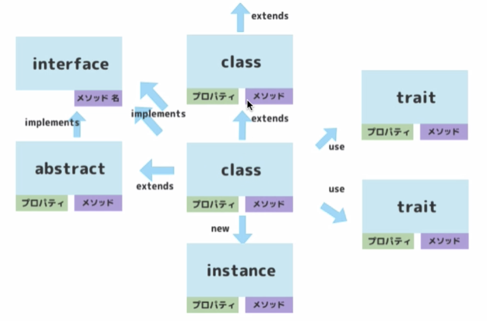
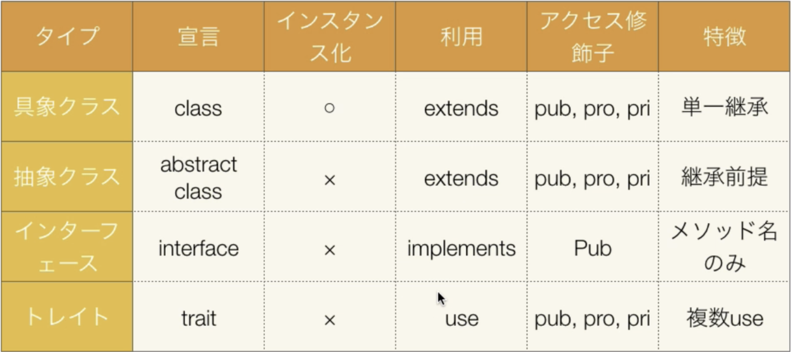

## PHP에서의 객체 지향 용어와 관계





## 클래스와 인스턴스

```php
<?php

class Product
{
    private $product = [];

    public function __construct($product)
    {
        $this->product = $product;
    }

    public function getProduct()
    {
        echo $this->product;
    }

    public function addProduct($item)
    {
        $this->product .= $item;
    }

    public static function getStaticProduct($str)
    {
        echo $str;
    }
}

$instance = new Product('テスト');

var_dump($instance);
echo '<br />';

$instance->getProduct();
echo '<br />';

$instance->addProduct('追加分');

$instance->getProduct();
echo '<br />';

Product::getStaticProduct('静的');
echo '<br />';
```

위 예문은 일괄적인 클래스와 인스턴스의 사용 방법과 흐름이다. 지금까지 예문에서 나온 적 없는데, 생성자는 `__construct` 와 같은 형태로 정의할 수 있고, 정적 메소드는 static 키워드를 사용해서 정의하면 된다.

자꾸 까먹어서 추가로 적어두자면, 정적 메소드는 인스턴스와 관계 없이 클래스 자체로부터 접근하여 실행할 수 있는 메소드를 의미한다. 인스턴스를 통해서는 실행할 수 없기 때문에 인스턴스 문맥과 아무런 연관 없이 실행된다. php에서는 `클래스명::정적메소드명` 같은 형식으로 실행 가능하다.

## 계승

### extends

```php
<?php
class BaseProduct
{
    public function echoProduct()
    {
        echo '親クラスです';
    }
}

class Product extends BaseProduct
{
    private $product = [];
    // ...
}

$instance = new Product('テスト');
$instance->echoProduct();
echo '<br />';
# 親クラスです
```

계승은 extends를 이용하면 된다. 부모 클래스에 있는 모든 프로퍼티에 접근 가능하다.

### override

부모 클래스에 존재하는 메소드와 동일한 명칭의 메소드를 자식 클래스에서 또 생성하게 되면, 부모 클래스에 있는 동명의 메소드는 무시하고 덮어 쓸 수 있다. 또는 `::parent` 키워드를 사용하면 그냥 부모 클래스에 있는 동명의 메소드를 따르겠다는 뜻으로도 쓸 수 있다.

### final

```php
<?php
final class Product extends BaseProduct
{
    private $product = [];
    // ...
    final public function getProduct()
    {
        echo $this->product;
    }
    // ...
}
```

클래스 선언 시 앞에 final을 붙이면 더 이상 계승이 불가능한 클래스가 된다. 메소드 앞에 붙이면 메소드에 대한 계승도 막을 수 있다.

## 추상

### abstract

```php
<?php
abstract class ProductAbstract
{
    public function echoProduct()
    {
        echo '親クラスです';
    }

    abstract public function getProduct();
}
```

추상 메소드를 만들기 위해서는 abstract 키워드를 붙여준다. 추상 메소드에서는 실제 동작을 적을 수는 없고, 반드시 자식이 구현해야 한다는 강제성을 가지게 된다. 따라서 추상 메소드를 지닌 추상 클래스를 상속받은 자식 클래스는 반드시 추상 메소드를 구현해주어야 한다.

### interface

```php
<?php
interface ProductInterface
{
    public function getProduct();
}

interface NewsInterface
{
    public function getNews();
}

final class Product implements ProductInterface, NewsInterface
{
    // ...
     final public function getProduct()
    {
        echo $this->product;
    }

    public function getNews()
    {
        echo 'news!';
    }

}
```

interface의 내부는 abstract class와는 달리, 오로지 public의 abstract property만 작성해야 한다. 또한, 여러 개의 인터페이스를 동시에 승계받는 것도 가능하며, 승계 받은 자식 클래스는 승계한 인터페이스에 있는 추상 프로퍼티를 모두 구현해주어야 한다.

## 트레이트 (トレイト)

```php
<?php

trait ProductTrait
{
    public function getProduct()
    {
        echo 'プロダクト';
    }
}

trait NewsTrait
{
    public function getNews()
    {
        echo 'ニュース';
    }
}

class Product
{
    use ProductTrait;
    use NewsTrait;

    public function getInformation()
    {
        echo 'クラスです';
    }

    public function getNews()
    {
        echo 'クラスのニュース';
    }
}

$product = new Product();

$product->getInformation();
echo '<br />';
$product->getProduct();
echo '<br />';
$product->getNews();
echo '<br />';

```

trait는 interface처럼 인스턴트화 하지 못하지만, 반대로 내부에 동작하는 메소드를 정의해둘 수 있는 개념이다. `use` 키워드를 사용하여 복수의 trait를 가져와서 사용할 수 있으며, override도 가능하다.
