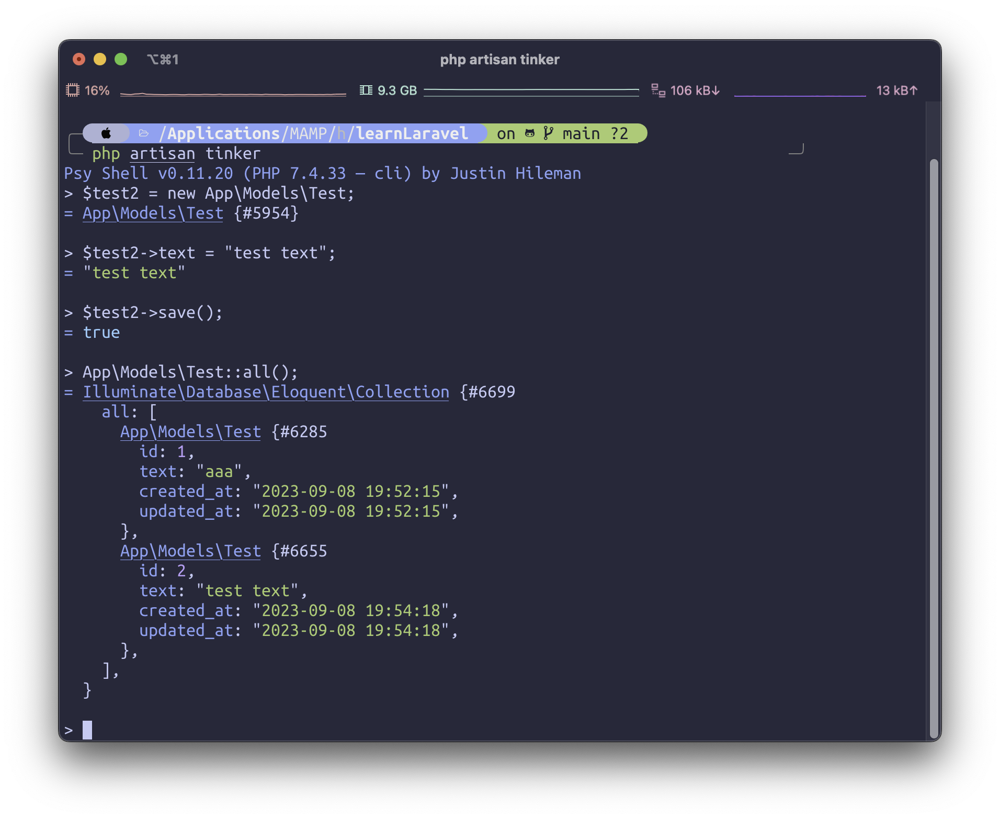

## 라라벨 프로젝트 준비

### PHP 버전 수정

```shell
brew tap shivammathur/php
brew install shivammathur/php/php@7.4
```

라라벨 6 버전을 사용하기 위해서 최신 버전인 php@8.2 대신 php@7.4를 설치한다. 공식 레포지토리로는 다운로드가 불가능하므로 구버전을 탭으로 받아준다.

```shell
brew install brew-php-switcher
```

홈 브루로 설치된 php의 버전을 바꿔주는 유틸리티를 설치해준다.

```shell
brew unlink php
brew-php-switcher 7.4

php -v
```

기존에 최신 버전으로 설치된 php가 있다면 브루로부터 unlink 해준뒤, brew-php-switcher로 7.4 버전으로 바꿔주면 된다.

## 라라벨 프로젝트 준비

```shell
composer create-project laravel/laravel {projectName} --prefer-dist "6.*"
```

현재 최신 버전은 9 이상이지만, 실무에서 사용하기 위해서 라라벨 6 버전을 설치한다.

```shell
php artisan serve
```

라라벨 프로젝트 디렉토리에 접근하여 위 명령어로 라라벨 서버를 켜주면 된다.

## 프로젝트 기본 설정

### 타임존 및 로케일 설정

`config/app.php` 파일에 'timezone’과 'locale’을 각각 ‘Asia/Tokyo’와 ‘ja’로 변경해준다.

### 데이터베이스 인코딩 설정

기본 chatset 설정은 이모지까지 사용할 수 있는 utf8mb4로 되어있는데 크게 지장없다면 utf8로 다 바꿔준다.

### 디버그바 라이브러리 설치

```shell
composer require barryvdh/laravel-debugbar
```

라라벨 프로젝트를 개발하며 디버깅하는 툴을 설치해준다. 해당 디버그 바는 .env의 APP_DEBUG 항목을 수정하면 표시 여부를 변경할 수 있다.

## Artisan

아티즌(artisan)은 라라벨에 포함된 CLI의 이름이다.

[Artisan | 라라벨 코리아](https://laravel.kr/docs/8.x/artisan)

### artisan으로 DB 모델 만들기

```shell
php artisan make:model Models/Test
```

위 명령으로 새로운 DB 모델을 만들 수 있다. 만든 모델은 app 폴더 내부에 생성된다.

```shell
php artisan list
```

artisan으로 내릴 수 있는 명령어 리스트를 확인하고 싶다면 list 커맨드를 붙이면 된다.

### artisan으로 마이그레이션 생성하기

마이그레이션은 데이터베이스의 버전 컨트롤과 같다.

[데이터베이스: 마이그레이션 | 라라벨 코리아](https://laravel.kr/docs/8.x/migrations#%EB%8D%B0%EC%9D%B4%ED%84%B0%EB%B2%A0%EC%9D%B4%EC%8A%A4:%20%EB%A7%88%EC%9D%B4%EA%B7%B8%EB%A0%88%EC%9D%B4%EC%85%98)

```shell
php artisan make:migration create-tests-table
```

라라벨은 마이그레이션 이름을 사용하여 테이블 이름을 추측하고 마이그레이션이 새 테이블을 생성할지 여부를 추측한다. 예를 들어 위의 마이그레이션 이름을 사용하면 tests 라는 이름의 테이블을 생성한다.

```shell
php artisan migrate
```

작성한 마이그레이션 파일을 데이터베이스에 반영하기 위해서는 위 커맨드를 입력해주면 된다.

### tinker



모든 라라벨 애플리케이션에는 REPL인 Tinker가 포함된다. Tinker를 사용하면 Eloquent ORM, Job, 이벤트 등 커맨드라인을 통해서 라라벨 애플리케이션을 조작할 수 있다. 위 스크린샷처럼 앞서 만든 데이터베이스에 값을 추가하는 것도 가능하다.

### 컨트롤러 생성

```shell
php artisan make:controller TestController
```

아티즌 커맨드로 컨트롤러를 생성할 수 있다. 생성된 컨트롤러는 app/Http/Controllers 폴더에 저장된다.

## MVC 모델

### Model

```php
<?php

use Illuminate\Database\Migrations\Migration;
use Illuminate\Database\Schema\Blueprint;
use Illuminate\Support\Facades\Schema;

class CreateTestsTable extends Migration
{
    /**
     * Run the migrations.
     *
     * @return void
     */
    public function up()
    {
        Schema::create('tests', function (Blueprint $table) {
            $table->bigIncrements('id');
            $table->string("text", 100);
            $table->timestamps();
        });
    }

    /**
     * Reverse the migrations.
     *
     * @return void
     */
    public function down()
    {
        Schema::dropIfExists('tests');
    }
}
```

앞서 `php artisan make:migration ~` 명령어로 작성한 마이그레이션 파일을 수정하여 모델 구조를 설정한다. 기본적으로 id와 createdAt, updatedAt이 포함되어 있으며, 예문에서는 text 필드를 추가해주었다.

### Controller

```php
<?php

namespace App\Http\Controllers;

use Illuminate\Http\Request;
use App\Models\Test;

class TestController extends Controller
{
    //
    public function index()
    {
        $values = Test::all();
        return view("tests.test", compact('values'));
    }
}
```

앞서 `php artisan make:controller ~` 로 만들었던 컨트롤러에서 데이터베이스에서 자료를 가져와서 뷰에 넘겨주는 역할을 수행해줄 수 있다. 예문에서는 `$values` 라는 변수에 데이터베이스의 모든 자료를 남아 선언해주었고 뷰에 담아서 리턴해주었다.

### View

```php
<?php

Route::get('/', function () {
    return view('welcome');
});

Route::get("tests/test", 'TestController@index');
```

먼저 표시할 뷰들에 대한 라우팅 처리를 해준다. `routes/web.php` 에서 표시할 모든 파일에 대한 라우팅을 연결해주는 것이 가능하다. 첫 번째 인자로는 라우팅 url을 입력해주고, 두 번째 인자로 Controller에서 넘겨받은 변수 등을 가져오는 것이 가능하다.

```php
# test.blade.php
test

@foreach($values as $value)

{{ $value->id }}<br />
{{ $value->text }}<br />

@endforeach
```

view는 `resources/views` 에서 작성할 수 있다. 모든 view는 기본적으로 blade.php로 작성하며, 데이터베이스에서 가져온 자료를 표시하거나 할 수 있다. view의 폴더 구조는 라우팅 구조를 동일하게 따른다.

```shell
php artisan route:list > route.txt
```

프로젝트의 전체 라우트 구조를 확인하고 싶다면 위 명령어로 현재 프로젝트의 라우트 구조를 문서화하여 출력할 수 있다.

## Eloquent

라라벨에는 Eloquent라는 이름의 ORM이 포함된다.

[Eloquent | 라라벨 코리아](https://laravel.kr/docs/6.x/eloquent)

### Collection

```php
$collection = collect([1, 2, 3]);
```

Collection 클래스는 배열 데이터를 사용하기 위한 유연하고 편리한 래퍼를 제공한다. `collect` 함수를 이용하여 새로운 Collection 인스턴스를 만들 수 있으며, 모든 Eloquent 쿼리의 결과는 항상 Collection 인스턴스를 반환한다. 정말 다양한 메소드를 포함하고 있으므로 유용하게 활용하면 좋다.

[사용 가능한 메소드 | 라라벨 코리아](https://laravel.kr/docs/6.x/collections#%EC%82%AC%EC%9A%A9%EA%B0%80%EB%8A%A5%ED%95%9C%20%EB%A9%94%EC%86%8C%EB%93%9C)

## Query Builder

라라벨의 데이터베이스 쿼리 빌더는 데이터베이스 쿼리들을 만들고 운영하는데 다양한 인터페이스의 편의기능을 제공한다. 라라벨의 쿼리 빌더는 PDO 파라미터 바인딩을 사용하여 SQL injection 공격을 방지하므로, 쿼리에 바인딩할 문자열들을 따로 정리하고 전달할 필요가 없다.

```php
# app/Http/Controllers/TestControllers.php
<?php

namespace App\Http\Controllers;

use App\Models\Test;
use Illuminate\Support\Facades\DB;

class TestController extends Controller
{
    public function index()
    {
        $tests = DB::table('tests')->select('id')->get();
        return view('tests.test');
    }
}
```

DB 파사드의 table 메소드를 사용하여 쿼리를 시작할 수 있다. table 메소드는 주어진 테이블에 대한 쿼리빌더 인스턴스를 반환하고, 다양한 제약을 메소드 체이닝 형태로 구성할 수 있으며, 마지막으로 get() 메소드를 사용하여 결과를 가져올 수 있다. 위의 예문에서는 tests 모델에서 id만 셀렉트하여 가져와서 표시하고 있다.

간단하게 데이터를 가져오는 경우에는 앞서 배운 컬렉션을 이용하여 가져오는게 낫고, 쿼리문의 조건이 복잡해지는 경우에는 쿼리 빌더를 사용하는 쪽이 좀 더 SQL 구문과 비슷하게 작성할 수 있으므로 유리한 면이 있을 수 있다. 상황에 따라 나눠서 사용하면 된다.

그걸로도 부족하면 [DB 파사드의 raw 메소드를 이용하여](https://laravel.kr/docs/6.x/queries#Raw%20%ED%91%9C%ED%98%84%EC%8B%9D) 쌩 SQL 구문을 작성하여 가져오는 방법도 있다. 하지만 raw는 쿼리를 문자열 형태로 주입하기 때문에 SQL 인젝션에 취약하지 않도록 유저의 입력이 없는 형태로 구현하는 것이 안전하다.

[Quries 시작하기 | 라라벨 코리아](https://laravel.kr/docs/6.x/queries#%EC%8B%9C%EC%9E%91%ED%95%98%EA%B8%B0)

## 파사드 (Facade아

파사드는 정면 입구라는 뜻의 프랑스어에서 유래한다. 애플리케이션의 서비스 컨테이너에서 사용가능한 클래스들에 대한 "정적" 인터페이스를 제공한다. 라라벨의 기능에 액세스하기 위한 수많은 파사드들을 제공하며, 모든 라라벨의 파사드는 `Illuminate\Support\Facades` 네임스페이스 안에 정의되어 있다. 앞서 사용했던 DB 파사드도 여기에서 가져와 사용했다.

[파사드 클래스 목록 | 라라벨 코리아](https://laravel.kr/docs/6.x/facades#%ED%8C%8C%EC%82%AC%EB%93%9C%20%ED%81%B4%EB%9E%98%EC%8A%A4%20%EB%AA%A9%EB%A1%9D)

파사드는 `/config/app.php` 에서도 파사드를 확인할 수 있으며, 실제 파일은 `/vendor/laravel/framework/src/Illuminate/Support/Facades` 안에 있다.

## 라라벨의 작동 방식과 흐름


`/public/index.php` 가 라라벨 프로젝트의 엔트리 포인트이다. 그 이후에는 HTTP 커널과 라우터, 미들웨어, 컨트롤러를 거쳐서 페이지가 표시되는 흐름이다.

[Laravel ﾜｶﾝﾈ(ﾟ ⊿ ﾟ)から「完全に理解した（）」までステップアップ](https://qiita.com/namizatork/items/801da1d03dc322fad70c)

## 블레이드

블레이드는 라라벨에서 제공하는 템플릿 엔진이며, 다른 PHP 템플릿 엔진들과는 달리 뷰에서 순수한 PHP 코드를 작성하는 것을 허용한다. 모든 블레이드 뷰는 단순한 PHP 코드로 컴파일되고 변경되기 전까지 캐시되기 때문에 블레이드는 애플리케이션에 아무런 부담을 주지 않는다.

### 기본적인 보안 기능 제공

```php
test

@foreach($values as $value)

{{ $value->id }}<br />
{{ $value->text }}<br />

@endforeach
```

이 코드는 앞서 작성한 `test.blade.php` 파일이다. `@foreach`와 `@endforeach`가 블레이드 전용 문법이다. 또한 두개의 중괄호로 감싼 부분은 XSS 공격 대책을 PHP의 `htmlspecialchars`를 이용해 어느 정도 알아서 처리해주는 구문이다. CSRF 대책은 `@csrf` 를 이용하여 대응하는 것이 가능하다.

### 레이아웃 템플릿 기능

```php
<!-- Stored in resources/views/layouts/app.blade.php -->

<html>
    <head>
        <title>App Name - @yield('title')</title>
    </head>
    <body>
        @section('sidebar')
            This is the master sidebar.
        @show

        <div class="container">
            @yield('content')
        </div>
    </body>
</html>
```

블레이드에는 레이아웃 템플릿을 정의하는 기능이 있다. 일단 위처럼 레이아웃을 정의해준다.

```php
<!-- Stored in resources/views/child.blade.php -->

@extends('layouts.app')

@section('title', 'Page Title')

@section('sidebar')
    @parent

    <p>This is appended to the master sidebar.</p>
@endsection

@section('content')
    <p>This is my body content.</p>
@endsection
```

이후에 앞서 선언한 레이아웃을 불러오며 레이아웃에 표시할 내용을 정의하여 수많은 반복 코드를 절약하는 것이 가능하다. React에서 레이아웃을 구현할 때 사용하는 Higher Order Component 기능과 굉장히 유사하고 거의 동일한 기능처럼 보여진다.

[Blade 레이아웃 정의하기 | 라라벨 코리아](https://laravel.kr/docs/6.x/blade#%EB%A0%88%EC%9D%B4%EC%95%84%EC%9B%83%20%EC%A0%95%EC%9D%98%ED%95%98%EA%B8%B0)

## 프론트엔드 스캐폴딩

```shell
composer require laravel/ui:^1.0 --dev
```

먼저 컴포저를 이용하여 laravel/ui를 설치해준다. 라라벨 6의 경우에는 최신 버전의 laravel-ui가 호환되지 않으므로 1.0 버전의 최신판을 설치해주도록 한다.

```shell
php artisan ui bootstrap --auth
```

bootstarp, react, vue의 세 가지 스캐폴딩이 있는데, 강의에서는 bootstrap의 auth 구현을 연습한다. Auth 관련된 코드는 `app/Http/Controllers/Auth` 폴더 안에 생성된다.

```shell
yarn && yarn dev
```

부트스트랩과 Auth 관련된 파일들이 설치되면 yarn dev로 프론트엔드 파일을 한 번 컴파일 해준다.

```shell
yarn watch
```

만약 프론트엔드 개발 시 핫 리로딩을 사용하고 싶다면 watch를 이용하면 된다.

[Frontend 시작하기 | 라라벨 코리아](https://laravel.kr/docs/6.x/frontend#%EC%8B%9C%EC%9E%91%ED%95%98%EA%B8%B0)
