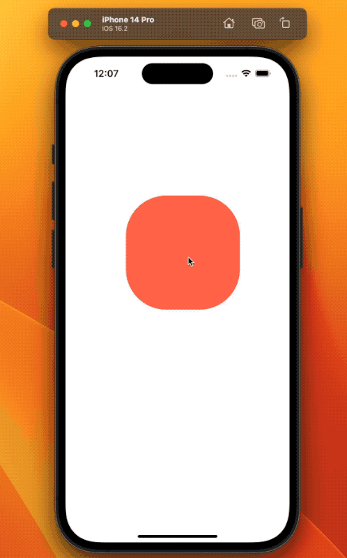
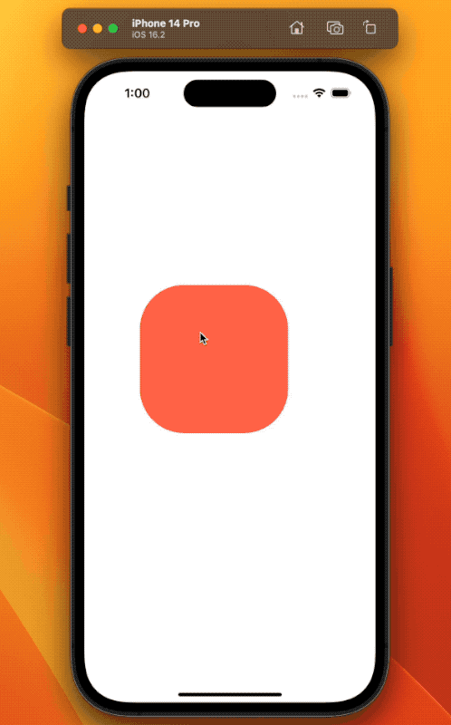

## PanResponder

```jsx
const panResponder = useRef(PanResponder.create({})).current;
console.log(panResponder);
```

PanResponder를 사용하면 손가락의 제스처, 움직임 등을 활용한 애니메이션을 구현할 수 있다. `PanResponder.create()`를 통해 입맛에 맞는 제스처를 설정하여 선언할 수 있으며, 일반적인 경우에는 useRef를 이용하여 컴포넌트 렌더링 시 유발되는 값 초기화를 방지해줄 필요가 있다.

```jsx
const panResponder = useRef(PanResponder.create({})).current;
return (
  <Container>
    <AnimatedBox {...panResponder.panHandlers} />
  </Container>
);
```

`PanResponder` 내부의 `panHandlers`에는 제스처를 위한 수많은 내장함수를 포함하고 있으며, 위처럼 Animated View Component에 넘겨주는 식으로 제스처 사용 등록이 가능하다.

[PanResponder | React Native Docs](https://reactnative.dev/docs/panresponder)

### onStartShouldSetPanResponder

```jsx
const panResponder = useRef(
  PanResponder.create({
    onStartShouldSetPanResponder: () => true,
  })
).current;
```

다시 PanResponder의 설정으로 돌아왔다. `onStartShouldSetPanResponder`에서는 PanResponder의 사용을 시작할 것인지 아닌지를 불리언 반환으로 결정시킨다. 특정한 상황에 도달했을 때 제스처의 작동을 멈추고 싶다면 이를 활용할 수 있을 것이다.

단순한 터치가 아니라 드래그처럼 손가락의 이동이 감지되었을 때만 제스처를 실행시키고 싶다면, `onMoveShouldSetPanResponder`를 사용할 수도 있다.

### onPanResponderMove

```jsx
const panResponder = useRef(
  PanResponder.create({
    onStartShouldSetPanResponder: () => true,
    onPanResponderMove: (_, gestureState) => {
      // d is for 'distance'.
      position.setValue({ x: gestureState.dx, y: gestureState.dy });
    },
  })
).current;
```

`onPanResponderMove`를 통해 제스처를 감지했을 때의 행동을 정할 수 있다. 매개변수로 제스쳐에 필요한 `event`와 `gestureState`를 제공받을 수 있는데, 손가락의 기준점으로부터의 거리 등 다양한 정보를 손에 넣을 수 있다. 그 외에 어떤 정보들이 담겨있는지는 공식문서를 보거나 직접 `console.log`로 찍어보면 된다.

그리고 이처럼 `Animated.Value`를 프리셋 애니메이션 없이 변경하고 싶을 때는 위처럼 `setValue`를 이용하면 된다. 앞에서 했던 것처럼 `Animated.timing`이나 `Animated.spring`으로 변경하면 프리셋 애니메이션 때문에 제스처에 딜레이 등의 효과가 생겨서 전혀 의도치 않은 애니메이션이 생성된다.

[Animated.ValueXY.setValue | React Native Docs](https://reactnative.dev/docs/animatedvaluexy#setvalue)

### onPanResponderGrant



여기까지만 설정했다면 두번째 이상의 제스쳐가 멀쩡하게 작동하지 않는다. 우리는 제스처를 감지할 때마다 `dx`와 `dy`라는 값을 얻어서 `setValue` 메소드를 통해 그대로 덮어씌워주고 있는데, 이 `dx`와 `dy` 값이 새롭게 제스처를 시작할때마다 0으로 돌아가기 때문이다.

그 이유는 `dx`와 `dy`의 d는 distance를 의미하고, 즉 사용자가 제스처를 시작한 이후로 얼마나 좌표를 움직였는지에 대한 값이기 때문이다. 따라서 하나의 제스쳐를 종료하고 두 번째 제스쳐를 시작할때는 다시 손가락이 처음 닿는 위치에서부터 얼마나 이동했는지를 계산하기 때문에 값이 즉시 0으로 되돌아가고, 이를 그대로 x와 y에 대입하고 있었으므로 위와 같은 이상한 점프가 일어나게 된다.

이를 해결하기 위해서는 dx와 dy가 0부터 시작하지 않고 이전 제스쳐에서 움직였던 마지막 값을 기억하도록 해야한다는 해결법을 떠올릴 수 있다.

```jsx
const panResponder = useRef(
  PanResponder.create({
    /* ... */
    onPanResponderGrant: () => {
      position.setOffset({ x: position.x._value, y: position.y._value });
    },
  })
).current;
```

`dx`와 `dy`가 0으로 돌아가기 전에 오프셋을 지정해줄 수 있는데, 이를 위해 `onPanResponderGrant`라는 함수를 이용한다. 제스처가 감지된 직후, 그리고 제스처가 실제로 실행되기 전에 수행시키고 싶은 행동들을 지정해줄 수 있다.

`setOffset`은 `setValue`처럼 직접 x나 y의 값을 지정하는 대신에, 오프셋으로서의 값을 지정해줄 수 있다. `Animated.ValueXY`에서 `x._value`, `y._value` 등의 형식으로 기존 값을 꺼내올 수 있는데, 이를 오프셋으로 지정하게 되면 가장 마지막에 움직였던 위치의 값을 오프셋으로 계속해서 불러오는 형태가 된다.

[Animated.ValueXY.setOffset | React Native Docs](https://reactnative.dev/docs/animatedvaluexy#setoffset)

### onPanResponderRelease

얼핏 처음 두 번은 잘 작동하는 듯 하지만 여러 번 제스처를 시도했을 때 움직임이 다시 이상하게 바뀌어버린다. 움직임이 감지될 때마다 오프셋을 추가하니 점점 첫 시작 위치가 뒤틀리는 것이다. 따라서 제스쳐가 종료될 때는 `dx`와 `dy`에게 이전에 이동한 만큼의 좌표 오프셋을 더해주는 한편으로, 다음 제스처가 시작할 때는 해당 오프셋을 불러오지 못하도록 0으로 바꾸어주는 평탄화(flatten) 작업이 필요하다.

```jsx
const panResponder = useRef(
  PanResponder.create({
    /* ... */
    onPanResponderRelease: () => {
      position.flattenOffset();
    },
  })
).current;
```



`onPanResponderRelease`를 이용하면 사용자가 제스처를 종료했을 때 실행할 함수를 작성할 수 있다. 여기에서 오프셋 값을 평탄화하면 된다.

[Animated.ValueXY.flattenOffset | React Native Docs](https://reactnative.dev/docs/animatedvaluexy#flattenoffset)
