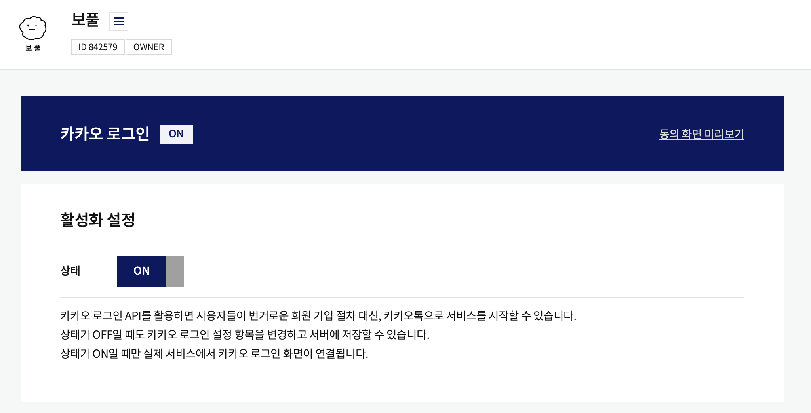
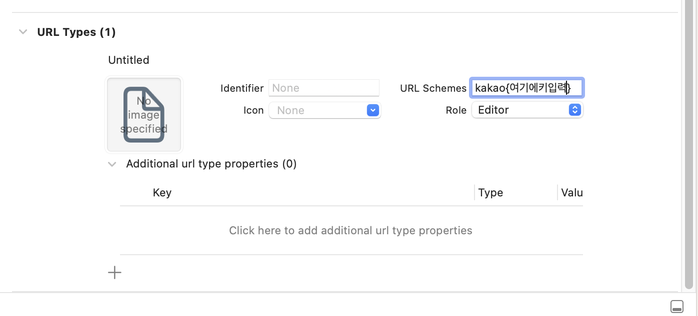
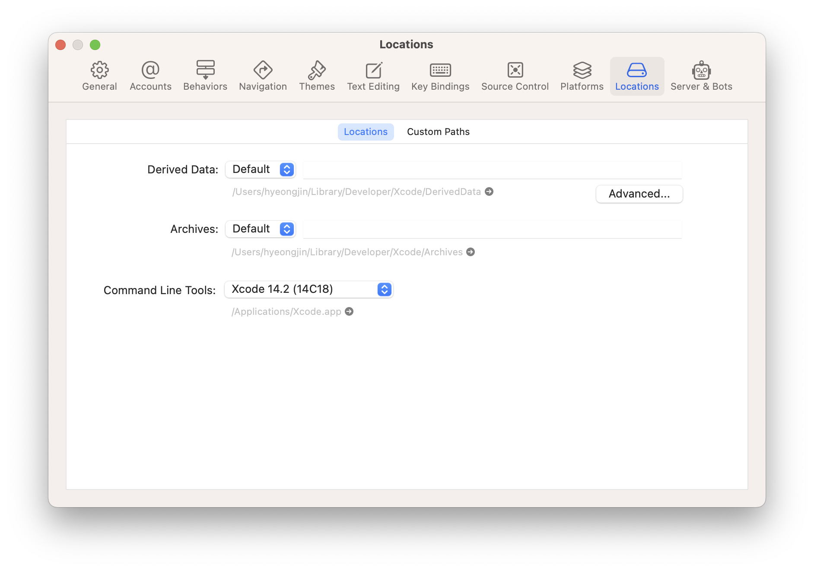

사이드 프로젝트를 진행하면서 카카오 로그인을 구현해야 할 일이 생겼다. 사용자가 귀찮게 비밀번호를 기억하지 않아도 서비스를 이용할 수 있기 때문에 사용자 경험에 지대한 영향이 있다.

외부 로그인 연동에 대한 경험이 전혀 없었지만, 다행히도 국내 개발자 분이 만들어주신 [훌륭한 라이브러리](https://github.com/react-native-seoul/react-native-kakao-login)가 있었고 깃허브에 훌륭한 step-by-step 문서와 유튜브 영상 또한 함께 제작해서 올려주신 덕분에 크게 헤매지 않고도 구현이 가능했다. 다만 리액트 네이티브 개발 경험이 많지 않은터라, 그 과정에서 겪었던 문제들이나 새롭게 배운 팁들이 있어서 그러한 것들을 몇 가지 추가한 구현 과정을 소개하고자 한다.

## 프로젝트 요구사항

> Pod에서 iOS deployment target이 11.0 이상이어야 합니다.

```Podfile
platform :ios, podfile_properties['ios.deploymentTarget'] || '13.0
```

내 경우에는 [create-react-native-app](https://github.com/expo/create-react-native-app)을 이용하여 프로젝트를 시작했었는데, 처음부터 Pod의 iOS deployment target이 13.0으로 설정되어 있었기 때문에 따로 건드릴 필요는 없었다. 타겟 버전 정보는 `ios` 폴더 안의 `Podfile`을 참고하여 수정해주면 된다.

### 카카오 개발자 설정



[카카오 개발자 공식 문서](https://developers.kakao.com/docs/latest/ko/kakaologin/prerequisite)를 참고하여 카카오 로그인에 필요한 네이티브 앱 키를 발급받고, 카카오 로그인을 활성화 설정한다.

## 라이브러리 설치

```sh
yarn add @react-native-seoul/kakao-login
npx pod-install
```

앞서 소개한 npm 라이브러리를 설치하고, iOS는 pod install을 해주어야 정상적으로 설치가 완료된다.

### pod install이 제대로 되지 않는다면

```sh
sudo gem install cocoapods
```

내 경우에는 애플 실리콘 기반의 맥을 사용하고 있었고 초기 설정 이후 정말 오랜만에 pod install 과정에서 오류가 발생했었는데 대부분의 경우 cocoapod를 재설치해보면 해결되는 경우가 많다. [이 블로그](https://medium.com/@alberto.schiabel/how-to-fix-pod-install-error-in-react-native-on-mac-m1-5d79dc52f7e8)에서 도움을 얻었다.

## XCode에서 설정 이어하기

```sh
xed ios
```

이제부터 ios 프로젝트 폴더 내의 `info.plist` 파일을 수정해야 하는데, XCode를 직접 실행하여 설정하는 것이 가장 실수없이 안전하게 수정이 이루어지는 것 같았다. 위 명령어를 입력하면 리액트 네이티브 프로젝트가 xcode 상에서 바로 실행된다.

### URL Types 추가



XCode 프로젝트의 Info 탭에서 URL Types를 추가할 수 있는데, URL Schemes에 위처럼 입력해준다. 키는 `kakao + 네이티브 앱 키`를 입력해주면 된다. 그러면 info.plist가 수정된 것을 확인할 수 있다.

### info.plist 직접 수정

```info.plist
  <key>CFBundleVersion</key>
  <string>1</string>
+ <key>KAKAO_APP_KEY</key>
+ <string>{카카오 네이티브앱 키를 적어주세요}</string>
+ <key>LSApplicationQueriesSchemes</key>
+ <array>
+   <string>kakaokompassauth</string>
+   <string>storykompassauth</string>
+   <string>kakaolink</string>
+ </array>
```

KAKAO_APP_KEY와 관련한 데이터는 직접 수정하여 추가해주어야 한다. CFBundleVersion 아래에 위와 같이 코드를 추가로 작성해주면 준비 완료! 바로 빌드해서 무리 없이 실행되는지 확인해보면 된다.

### Swift Bridging Header 추가 (문제 발생 시에만)


내 경우에는 [create-react-native-app](https://github.com/expo/create-react-native-app)의 최신 버전으로 설치하자 따로 이 과정이 필요하지는 않았다. 만약 빌드 시 문제가 발생한다면 XCode 상에서 프로젝트에 swift 파일을 아무거나 하나 새롭게 추가하여 Swift Bridging Header를 추가하는 과정이 필요하다고 한다. 카카오 로그인 라이브러리의 공식 문서에 이에 대해 잘 설명해주고 있으니 참고하면 될 듯 하다.

## 코드 작성

```tsx
const signInWithKakao = async () => {
  try {
    const token = await login();
    setToken(JSON.stringify(token));
  } catch (err) {
    console.error("login err", err);
  }
};
/* ... */
return (
  <View>
    <TouchableOpacity text="카카오로 로그인" onPress={signInWithKakao} />
  </View>
);
```

라이브러리에 샘플 코드가 잘 작성된 것이 있으므로 참고하면 좋다. login, logout, getProfile, unlink 등등 다양한 메소드가 준비되어 있으므로 라이브러리 공식 문서를 참고해서 적용하면 된다.

## 그 외 작업하며 겪은 오류들

### code 65 에러 발생 시



[Positiveko TIL](https://positiveko-til.vercel.app/til/react-native/error65.html#_1-xcode%E1%84%8B%E1%85%A6%E1%84%89%E1%85%A5-derived-data-%E1%84%89%E1%85%A1%E1%86%A8%E1%84%8C%E1%85%A6%E1%84%92%E1%85%A1%E1%84%80%E1%85%B5)에서 문제 해결 과정을 공유해주신 덕분에 도움을 받았다. 혹시라도 빌드가 되지 않고 code 65 에러가 발생하는 경우에는 pod file이 꼬인 것이므로, XCode의 Derived Data 폴더 안을 한 번 싹 비워보고 `Podfile.lock`을 삭제한 다음에 pod install을 다시 해보길 바란다.

### launchpackager.command 실행 오류

> launchpackager.command이(가) 터미널에서 문서를 열도록 허용되지 않았기 때문에 ‘(null)’을(를) 열 수 없습니다.

iTerm2를 기본 터미널로 사용하는 macOS Ventura 유저에게 발생하는 문제인데, `node_modules/react-native/scripts/` 폴더에 있는 `launchPackager.command` 파일의 기본 실행 프로그램을 iTerm2로 바꿔주면 오류가 발생하지 않는다. [스택오버플로우 게시글](https://stackoverflow.com/questions/74187734/launchpackager-command-can-t-be-opened)에서 해결에 도움을 얻었다.

## 마무리

리액트 네이티브는 오직 자바스크립트만 생각하며 네이티브 사이드에 완전히 등돌리고 모른채 하면서 개발할 수 있는 마법같은 환경이 아니라는 걸 다시 한 번 느꼈다. 어느 정도 양측 네이티브 환경에 대한 기본적인 지식이 있으면 오류 해결을 훨씬 유연하게 대처할 수 있지 않을까, 하는 한계 혹은 새로운 공부 욕심을 느끼기도 했다.
